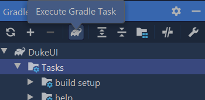

<frontmatter>
  title: "Gradle tutorial"
  pageNav: 3
</frontmatter>



# Gradle tutorial

Gradle is a _build automation tool_ used to automate build processes. There are many ways of integrating Gradle into a project. This tutorial uses the _Gradle wrapper_ approach.

<!-- ==================================================================================================== -->

## Basics

You use a _build file_ (named `build.gradle`) to describe the project to Gradle. A build file mainly consists of _plugins_, _tasks_ and _properties_. 

* **Plugins** extend the functionality of Gradle. For example, the `java` plugin adds support for `Java` projects.

* **Tasks** are reusable blocks of logic. For example, the task `clean` simply deletes the project build directory. 
Tasks can be composed of, or dependent on, other tasks. 

* **Properties** change the behavior of tasks. For instance, `mainClassName` of the `application` plugin is a compulsory property which tells Gradle which class is the entry point to your application. As Gradle favors [_convention over configuration_](https://en.wikipedia.org/wiki/Convention_over_configuration), there is not much to you need to configure if you follow the recommended directory structure.

<!-- ==================================================================================================== -->

## Adding Gradle to the project

****Scenario 1:**** You are setting up a project in Intellij IDEA. The project already has Gradle support.

<div class="ml-3">

{{ icon_tip }} If the project comes with Gradle support, you will see a `build.gradle` file in your project root.
</div>

1. Open Intellij (if you are not in the welcome screen, click `File` > `Close Project` to close the existing project first)
1. Open the project into Intellij as follows:
   1. Click `Open`.
   1. Select the project directory, and click `OK`.
   1. If there are any further prompts, accept the defaults.
1. After the importing of the project is complete, you will see the `Gradle Toolbar` in the IDEA interface %%e.g., look for the elephant icon (on Windows, this appears on the right-edge of the IDE window) and click it%%.<br>
   

****Scenario 2:**** You are adding Gradle support to an ongoing project that is already set up in Intellij IDEA. Gradle wrapper files have been provided.

1. Add the Gradle wrapper files to the project. e.g., if they are in a separate branch, merge that branch.
1. Close the IDEA project if it is open.
1. Delete the `.idea` folder.
1. Open/import the project again, as explained in scenario 1 above.

****Scenario 3:**** You are adding Gradle support to an ongoing project from scratch.

* [This](https://docs.gradle.org/current/userguide/gradle_wrapper.html) is a good place to start.

<!-- ==================================================================================================== -->

## Using Gradle in Intellij IDEA


If the Gradle tasks don't appear in the Gradle window, click the 'refresh' button in the tooolbar to reimport the Gradle project.

Intellij uses Gradle to run your application by default. If you would like to run the project in the normal way, go to `File` > `Settings` and change the following settings:<br>

 
<!-- ==================================================================================================== -->

## Running Gradle Tasks

To run a task, locate the task in the Gradle toolbar, right-click on a task, and choose `run`.

Alternatively, you can type the command in the terminal.

* On Windows: `gradlew <task1> <task2> …`​ e.g. `gradlew clean test`
* On Mac/Linux: `./gradlew <task1> <task2> …`​ e.g. `./gradlew clean test`

<!-- ==================================================================================================== -->

## Adding plugins

Gradle plugins are reusable units of build logic. Most common build tasks are bundled into core plugins provided by Gradle. Java, Checkstyle, and Shadow are three of plugins commonly used in Java projects.
The relevant lines of the `build.gradle` are given below:

```groovy {highlight-lines="2-5", heading="build.gradle"}
plugins {
    id 'java'
    id 'application'
    id 'checkstyle'
    id 'com.github.johnrengelman.shadow' version '5.1.0'
}
```

<!-- ==================================================================================================== -->

## Using Gradle to do some common project activities

<!-- ------------------------------------------------------------------------------------------------------ -->

### Cleaning the project

* **`clean`**: Deletes the files created during the previous build tasks (e.g. files in the `build` folder).<br>
  e.g. `./gradlew clean`

<box>

{{ icon_tip }} **You can use `clean` to prevent Gradle from skipping tasks**: When running a Gradle task, Gradle will try to figure out if the task needs running at all. If Gradle determines that the output of the task will be same as the previous time, it will not run the task. For example, it will not build the JAR file again if the relevant source files have not changed since the last time the JAR file was built. If you want to force Gradle to run a task, you can combine that task with `clean` (e.g., `./gradlew clean shadowJar`). Once the build files have been `clean` ed, Gradle has no way to determine if the output will be same as before, and it will have no choice but to execute the task.

</box>

<!-- ------------------------------------------------------------------------------------------------------ -->

### Running Checkstyle

`gradlew checkstyleMain checkstyleTest`: runs main code and test code complies with the Checkstyle rules. <br>

**Resources**:
* [Checkstyle Tutorial](checkstyle.html)
* [Gradle documentation for the Checkstyle plugin](https://docs.gradle.org/current/userguide/checkstyle_plugin.html)

<!-- ------------------------------------------------------------------------------------------------------ -->

### Running tests

Run the `test` task to run the tests in the project.


**Resources**:
* [Gradle documentation for JUnit](https://docs.gradle.org/current/userguide/java_testing.html#using_junit5)

<!-- ------------------------------------------------------------------------------------------------------ -->

### Creating JAR files

<span id="section-creating-jar-files">

[Shadow](https://github.com/johnrengelman/shadow) is a plugin that packages an application into an executable _fat_ jar file _if the current file is outdated_.

{{ embed("Tutorials → Working with JAR files → **Fat JAR files**", "jar-fatJar.mbdf") }}

The task **`shadowJar`** (e.g., running the command `gradlew shadowJar` or `gradlew clean shadowJar`) creates the JAR file in the `build/libs` folder. By default, it produces a jar file with the name in the format of `{archiveBaseName}-{archiveVersion}.jar` and put it in the `builds/libs` folder. These properties can be set in the `build.gradle` file.

{{ icon_info }} Ensure your `build.gradle` file contains the correct values w.r.t. the Shadow plugin e.g., `mainClassName`

{{ icon_info }} If you are using JavaFX, see the panel below to find what else you need to add to the `build.gradle` to pack JavaFX libraries into the generated JAR file.

{{ embed("Tutorials → JavaFX Tutorial Part 1 → If you are using Gradle", "javaFxPart1.md#javafx-gradle") }}

**Resources**:
* [Gradle documentation for the Shadow plugin](https://plugins.gradle.org/plugin/com.github.johnrengelman.shadow)
* [More about the Shadow plugin](https://imperceptiblethoughts.com/shadow/introduction/)
</span>

<!-- ------------------------------------------------------------------------------------------------------ -->

### Compiling

There is no need to run these Gradle tasks manually as they are called automatically by other relevant Gradle tasks.

* **`compileJava`**: Checks whether the project has the required dependencies to compile and run the main program, and download any missing dependencies before compiling the classes. See `build.gradle` → `allprojects` → `dependencies` → `compile` for the list of dependencies required.
* **`compileTestJava`**: Checks whether the project has the required dependencies to perform testing, and download any missing dependencies before compiling the test classes. See `build.gradle` → `allprojects` → `dependencies` → `testCompile` for the list of dependencies required.

<!-- ==================================================================================================== -->

### Enabling assertions

To enable assertions when executing Java code, add the following to the `build.gradle` file.

```groovy
run {
    enableAssertions = true
}
```

<!-- ==================================================================================================== -->

## Managing dependencies

Gradle can automate the management of dependencies to third-party libraries. You just need to add the dependency into the `build.gradle` file and Gradle will do the rest. For example, here is how the JUnit library has been added to the dependencies in the `build.gradle`:
```groovy
dependencies {
    testImplementation group: 'org.junit.jupiter', name: 'junit-jupiter-api', version: '5.5.0'
}
```

For example, to add the Natty (a third-party library used for parsing natural lanaguage dates e.g., `today`), you simply have to add the following line to the `dependencies` section of the `build.gradle` file.
```groovy
compile group: 'com.joestelmach', name: 'natty', version: '0.6'
```

Tip: Most third-party libararies specify how to add it as a Gradle dependency ([example](https://mvnrepository.com/artifact/com.joestelmach/natty/0.6)).

<!-- ==================================================================================================== -->

## Resources

* [Official Gradle Documentation](https://docs.gradle.org/current/userguide/userguide.html)

----------------------------------------------------------------------------------------
**Authors:**
* Initial Version: Jeffry Lum
