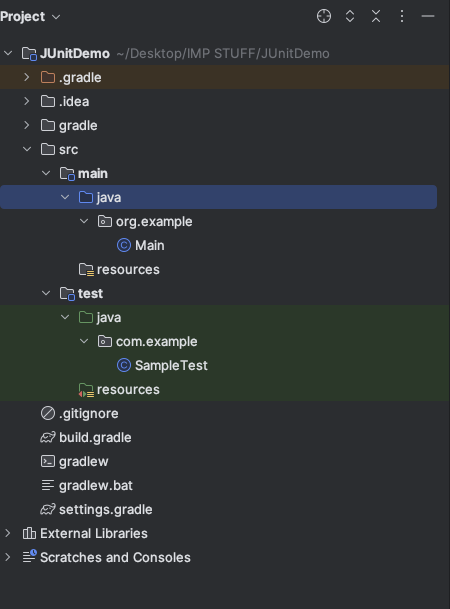
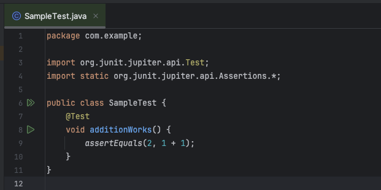
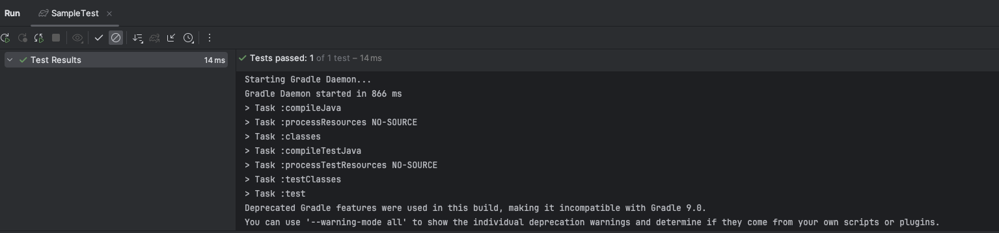

<frontmatter>
  title: "IntelliJ: Running and Debugging JUnit Tests"
</frontmatter>

# IntelliJ: Running and Debugging JUnit Tests

<box type="info" seamless>
This tutorial will help you:
- Set up JUnit support in a Gradle-based IntelliJ project
- Understand correct test folder structure and naming conventions
- Write and run your first JUnit test
- Debug failing test cases using breakpoints
- View test results using IntelliJ's JUnit test runner
</box>

---

## Prerequisites

Ensure you have:
- IntelliJ IDEA installed
- A Java project using **Gradle** as the build system
- **JDK 17** installed and selected in IntelliJ
- Internet access to download Gradle and JUnit dependencies

<box type="tip" seamless>
You can verify JDK selection under `File > Project Structure > Project SDK`. It should be set to JDK 17.
</box>

---

## Adding JUnit to Gradle

To enable JUnit 5 testing, add the following to your `build.gradle` file:

```groovy
plugins {
    id 'java'
}

dependencies {
    testImplementation 'org.junit.jupiter:junit-jupiter:5.10.0'
}

test {
    useJUnitPlatform()
}
```

<box type="tip" seamless>
After editing `build.gradle`, click the **Gradle refresh** button in the Gradle tool window (right sidebar) or select `File > Sync Project with Gradle Files`.
</box>

---

## Project Folder Structure

A typical Gradle Java project should follow this structure:

```text
your-project/
├── build.gradle
├── settings.gradle
└── src/
    ├── main/
    │   └── java/
    │       └── org/example/Main.java
    └── test/
        └── java/
            └── com/example/SampleTest.java
```

<box type="tip" seamless>
Right-click the `main/java` and `test/java` folders in IntelliJ and use **Mark Directory As > Sources Root** and **Test Sources Root** respectively.
</box>



---

## Creating Your First Test

1. Inside `src/test/java`, right-click and select **New > Package** → name it `com.example`  
2. Right-click on the package → **New > Java Class** → name it `SampleTest`  
3. Paste the following code:

```java
package com.example;

import org.junit.jupiter.api.Test;
import static org.junit.jupiter.api.Assertions.*;

public class SampleTest {
    @Test
    void additionWorks() {
        assertEquals(2, 1 + 1);
    }
}
```

<box type="info" seamless>
If JUnit is configured properly, you should see a **green play icon** next to the method and class name.
</box>



---

## Running Tests

You can run a test in several ways:
- Click the **green play icon** next to the test method or class
- Right-click on the test file and choose **Run 'SampleTest'**

After running, the test results appear in the **Run** window at the bottom.



---

## Debugging Tests

To debug:
1. Click in the left gutter next to a line to set a **breakpoint** (red dot)
2. Right-click the test method → **Debug 'additionWorks'**
3. The debugger will pause at the breakpoint, allowing you to inspect variables, step through code, etc.

<box type="tip" seamless>
You can also use the **Debugger panel** to evaluate expressions and manage breakpoints.
</box>

---

## Viewing Test Coverage (Optional)

If you have IntelliJ Ultimate or a supported plugin:
- Right-click the test file → **Run with Coverage**
- Covered lines will be highlighted in green; uncovered lines in red

---

## Useful Tips

<box type="tip" seamless>
<ul>
  <li>IntelliJ can auto-generate test method skeletons. Right-click a class → <code>Generate > Test Method</code></li>
  <li>You can rerun failed tests by clicking the <strong>Rerun Failed Tests</strong> button in the test result window</li>
  <li>You can also use <code>Ctrl + Shift + F10</code> (or <code>Cmd + Shift + F10</code> on Mac) to quickly run the test under your cursor</li>
</ul>
</box>


---

**Contributors**: Arshin Sikka ([@arshinsikka](https://github.com/arshinsikka))
