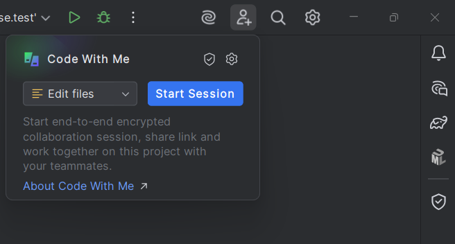
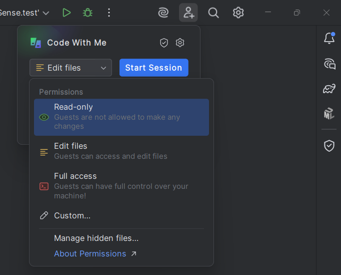
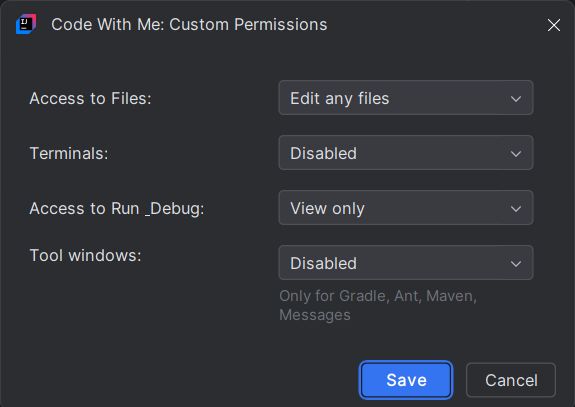
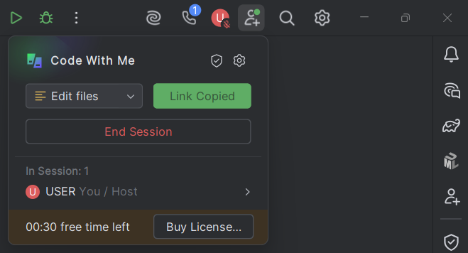
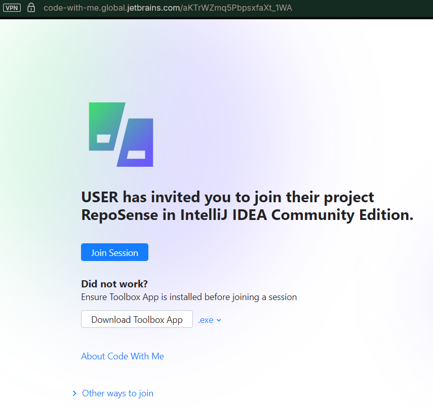
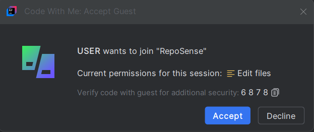


<frontmatter>
  title: "{{ title }}"
  pageNav: 3
</frontmatter>

<include src="../common/common-fragments.md#wip-warning" />

<!-- --------------------------------------------------------------------------------------------------------- -->

# {{ title }}

**Code With Me** is a collaborative development service in IntelliJ IDEA that allows multiple developers to work together on the same codebase in **real-time**. It enables you to share your IDE session with others so they can view/edit your code and even run applications together.

This tutorial covers basics of the Intellij IDEA's **Code With Me** feature.

<!-- --------------------------------------------------------------------------------------------------------- -->

## Install Code With Me Plugin (if not pre-installed)
1. Open IntelliJ IDEA.
2. Go to File → Settings → Plugins (or IntelliJ IDEA → Preferences → Plugins on macOS).
3. Search for **Code With Me**.
4. If it's not installed, click **Install**.
5. **Restart** IntelliJ IDEA after installation.

<!-- --------------------------------------------------------------------------------------------------------- -->

## Starting a session

1. Open your project in IntelliJ IDEA.
2. Go to the **top-right corner** where the toolbar has a small Code With Me icon (Shortcut: Ctrl+Shift+Y).

  

 

3. Alternatively, access via Tools → Code With Me.

<!-- --------------------------------------------------------------------------------------------------------- -->

## Configure Session Permissions

  

 

  

 

* **Read-Only**: Guests can only view code.

* **Edit Files**: Guests can edit files but cannot run/debug.

* **Full Access**: Guests can edit code, run code, and use terminal.

* **Custom**: Manually choose permissions (terminal, run, etc.).

Select the appropriate access level for your session and click **Start Session** and then click **Copy Link**.

  

 

<!-- --------------------------------------------------------------------------------------------------------- -->

## Send & Receive Invitation

* **Host**:
Send the invitation link to your guest via email, chat, etc...

* **Guest**:
  * The guest can join by opening the invitation link in a web browser and click `Join Session`.
  * The link will prompt the guest to open IntelliJ IDEA.
  * IntelliJ IDEA will automatically attempt to connect to the Code With Me session.

  

 

* **Host Approval**:
  * After the guest has opened the link, the host will see a prompt to approve the guest's request to join.
  * The host must click Accept to allow the guest into the session.

  

 

<!-- --------------------------------------------------------------------------------------------------------- -->

## Video Guide

@[youtube](3D4ypTcQXfc)

--------------------------------------------------------------------------------
**Authors:**
* Initial Version: [@lihongong](https://github.com/lihongong)

