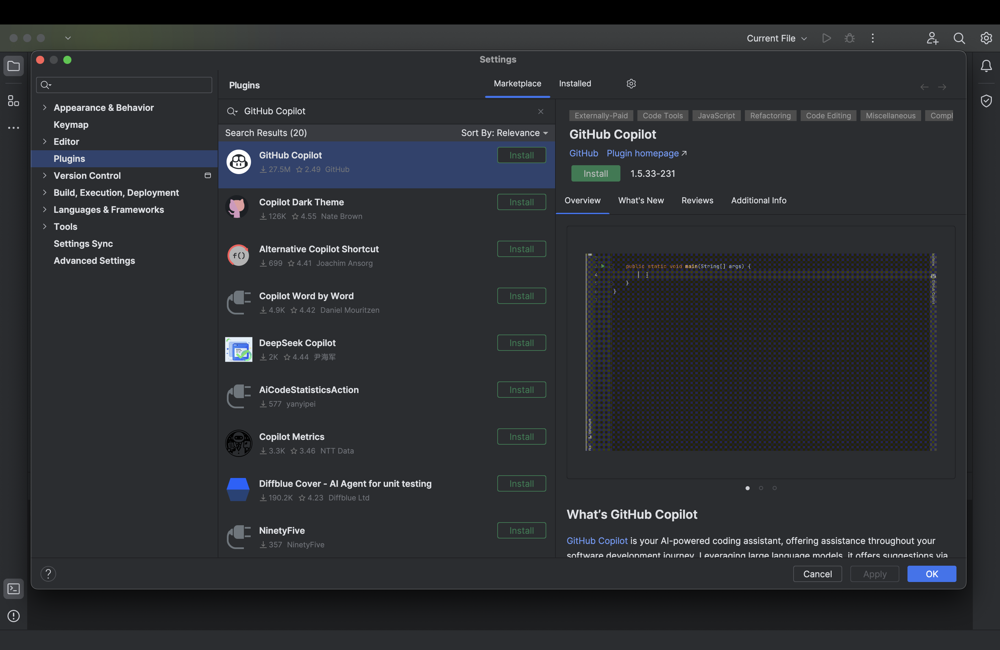
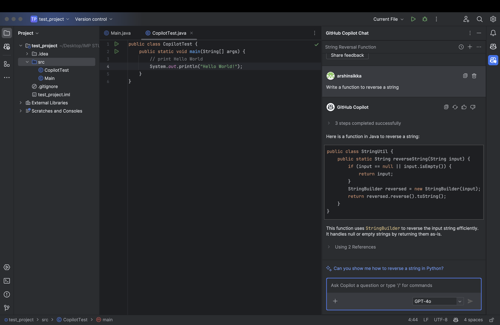

<frontmatter>
title: "IntelliJ IDEA – Using GitHub Copilot"
pageNav: 2
</frontmatter>

<include src="../common/common-fragments.md#wip-warning" />

# IntelliJ IDEA – Using GitHub Copilot

GitHub Copilot is an AI-powered code assistant that helps you write, test, and refactor code faster. In this tutorial, you’ll learn how to set up and use Copilot in IntelliJ IDEA — perfect for students in CS2103/T, CS2113, and other Java-heavy modules.

<box type="info" seamless>
To use GitHub Copilot for free as a student, you must:

1. Sign up for a GitHub account  
2. Enable two-factor authentication (2FA)  
3. Apply for the GitHub Student Developer Pack  

This guide walks you through setting up Copilot access and using it in IntelliJ IDEA.
</box>

---

## 1. Setting Up GitHub Copilot Access

Before using Copilot in IntelliJ, ensure your GitHub account has Copilot access (Student Developer Pack + 2FA).  
Follow the steps in the [Copilot access prerequisites](githubCopilot.md#prereq), then return here.

---

## 2. Installing GitHub Copilot Plugin in IntelliJ IDEA

1. Open IntelliJ IDEA.  
2. On Mac: **IntelliJ IDEA > Preferences**. On Windows/Linux: **File > Settings**.  
3. Select **Plugins > Marketplace**.  
4. Search for **GitHub Copilot**.  

5. Click **Install**, then **Restart IDE** when prompted.


---

## 3. Signing In to GitHub

1. After restart, open **Settings > Languages & Frameworks > GitHub Copilot**.  
2. Under **Authentication**, click **Manage GitHub Accounts**.  
3. Sign in via your browser and authorize Copilot.  
4. Your GitHub username should appear in the **Preferred GitHub account** dropdown.


---

## 4. Verifying Copilot in Action

1. Create or open a Java file, e.g., `CopilotTest.java`.  
2. Inside a `main` method, type:

```java
// print Hello World
```

3. Wait 2–3 seconds — a gray suggestion appears (see below).
4. Press **Tab** to accept the suggestion.


<box type="tip" seamless>
Copilot works best with clear, descriptive comments.
</box>

---

## 5. Using Copilot Chat *(if available)*

> Copilot Chat may be in beta or limited in IntelliJ.

1. Go to **View > Tool Windows > Copilot Chat**.  
2. Ask a question, e.g.:

```java
Write a function to reverse a string in Java.
```

3. Review the response and insert code as needed.



---

## 6. Troubleshooting

<box type="tip" seamless>
**Common Issues & Fixes**  

- **No suggestions** → Ensure the plugin is enabled and you’re signed in.  
- **No Copilot panel** → Restart IntelliJ or reinstall the plugin.  
- **Unsupported file type** → Use `.java` or other supported languages.  
- **Authentication errors** → Re-authorize in **Settings > GitHub Copilot**.  
</box>

---

**Contributors**: Arshin Sikka ([@arshinsikka](https://github.com/arshinsikka))

