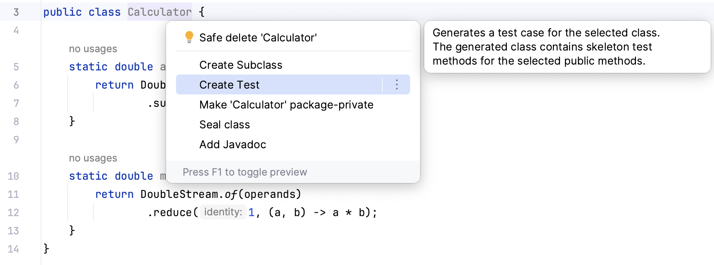
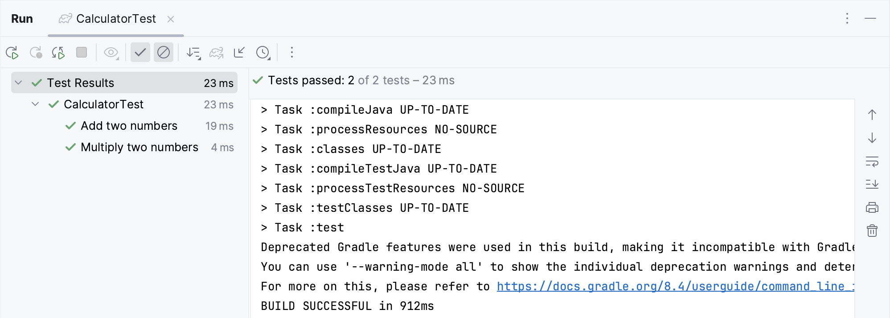



<frontmatter>
  title: "{{ title }}"
  pageNav: 2
</frontmatter>

<include src="../common/common-fragments.md#wip-warning" />

# {{ title }}

This tutorial covers the basics of setting up and using JUnit with IntelliJ.

<!-- ======================================================== -->

## Prerequisites

<include src="junit.md#junit-use-gradle" />

This tutorial assumes you are using Gradle to manage JUnit dependencies.

<!-- ======================================================== -->

## Setting Up JUnit with Gradle

#### Add Gradle Support

If your project doesn’t yet use Gradle, follow the [Gradle Tutorial](https://se-education.org/guides/tutorials/gradle.html) to set it up.

#### Add JUnit as a Dependency

1. Open the `build.gradle` file in your project’s root directory.
   <box type="tip" seamless>

   Press {{ show_keys("<kbd>Ctrl</kbd> <kbd>⇧Shift</kbd> <kbd>O</kbd>", "<kbd>⌘Cmd</kbd> <kbd>⇧Shift</kbd> <kbd>O</kbd>") }} and search for `build.gradle` to locate it quickly.
   </box>
1. Follow the instructions [here](https://se-education.org/guides/tutorials/junit.html#configuring-gradle-for-junit) to add the JUnit dependency.
1. After editing `build.gradle`, refresh your Gradle project:
   * Press {{ show_keys("<kbd>Ctrl</kbd> <kbd>⇧Shift</kbd> <kbd>I</kbd>", "<kbd>⌘Cmd</kbd> <kbd>⇧Shift</kbd> <kbd>I</kbd>") }}. {texts="['3.1)', '3.2)']"}
   * In the Gradle tool window, click **Reimport All Gradle Projects**.

<!-- ======================================================== -->

## Writing Tests

You can write test classes manually by following [this guide](https://se-education.org/guides/tutorials/vscJUnitTesting.html#conventions-to-follow). Alternatively, you can let IntelliJ generate test templates for you:

1. Place your cursor on the class name you want to test.
1. Press {{ show_keys("<kbd>Alt</kbd> <kbd>Enter</kbd>", "<kbd>Option</kbd> <kbd>Enter</kbd>") }} or right-click and choose `Show Context Actions`.
1. Select `Create Test` from the menu.
   
1. Choose the methods to generate tests for. 
   <pic src="./images/intellij/test-menu.png" width="450" />

IntelliJ will automatically create a test class and navigate you to it.

<!-- ======================================================== -->

## Running Tests

You may refer to the [JUnit tutorial](https://se-education.org/guides/tutorials/junit.html#running-tests) for how to run your tests.

After running tests, the results will be shown in the `Run` tool window. 

<!-- ======================================================== -->

<include src="junit.md#useful-test-cases" />

<!-- ======================================================== -->

## Optional: Create a JUnit Run Configuration

If you want more control over how tests are executed:

1. Go to `Run` → `Edit Configurations` from the main menu.
1. Click <kbd>+</kbd> or {{ show_keys("<kbd>Ctrl</kbd> <kbd>N</kbd>", "<kbd>⌘Cmd</kbd> <kbd>N</kbd>") }}.
1. Select `JUnit` from the configuration templates.
1. Configure options as desired.

Refer to [IntelliJ documentation](https://www.jetbrains.com/help/idea/creating-and-running-your-first-java-application.html#run-configurations) for detailed instructions.

<!-- ======================================================== -->

<include src="junit.md#troubleshooting-junit" />

<!-- ======================================================== -->

---

**Contributors**: Song Yuexi ([@YosieSYX](https://github.com/YosieSYX))
