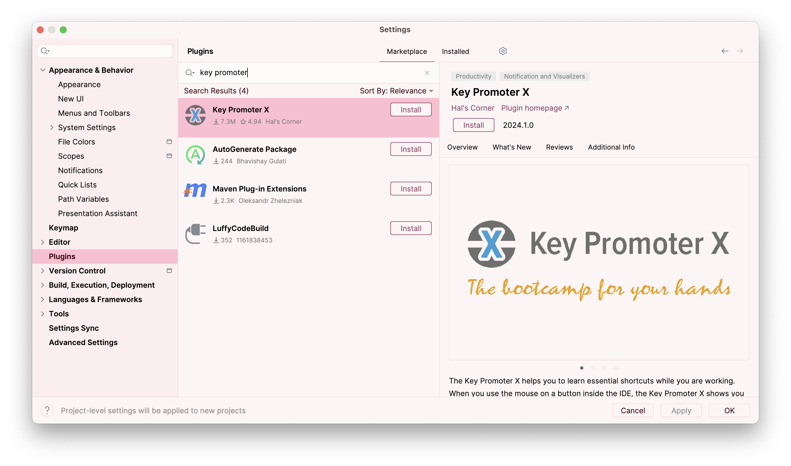


<frontmatter>
  title: "{{ title }}"
  pageNav: 3
</frontmatter>

<include src="../common/common-fragments.md#wip-warning" />

# {{ title }}

## PlantUML

**[PlantUML](http://plantuml.com/) is a tool for specifying various diagrams in a textual form.** It is particularly useful in software projects where you want to update the diagrams incrementally, as the project evolves over time.

The sections below explain how to install PlantUML. For more tips on **using PlantUML in a project**, click **[here](plantUml.html)**

<!-- --------------------------------------------------------------------------------------------------------- -->

### Setting up PlantUML in IntelliJ IDEA

1. Go to `File` \> `Settings` to access the `Settings` page.

2. Go to `Settings` \> `Plugins` \> `Marketplace` and install the plugin `PlantUML integration`.

3. Then go to `Settings` \> `Languages & Frameworks` \> `PlantUML` or search for PlantUML. You can also use a specific version of PlantUML from the [releases page](https://github.com/plantuml/plantuml/releases).
    

<!-- --------------------------------------------------------------------------------------------------------- -->

### Working with PlantUML in IntelliJ IDEA

After installing the `PlantUML integration` plugin, simply create or open any `.puml` file to start editing it.

Any changes you make in editor pane on the left will be reflected in the preview pane on the right. However, do take note that these changes *will not* be reflected in your actual documentation until you export the diagram.

****Saving the Diagram as an image****

* **When using MarkBind** as the site generation tool:
  * MarkBind has built-in support for PlantUML. The diagram will be generated and saved as an image automatically. No additional work needed from you. Refer to [this section of the MarkBind User Guide](https://markbind.org/userGuide/components/imagesAndDiagrams.html#plantuml-diagrams) for more details.
* **When using Jekyll** as the site generation tool:
  * The `PlantUML integration` plugin allows you to export individual diagrams to a location of your choosing. Click the `Save Current Diagram Only` button and choose the location to export the image file.
  * You will have to `git add` any new diagrams generated!

<!-- --------------------------------------------------------------------------------------------------------- -->

### PlantUML Tips and Tricks

You can refer to [this se-edu guide](plantUml.html#tips-and-tricks) to learn some tips and tricks useful for getting the diagrams to fit your needs.

## Code With Me

**Code With Me** is a collaborative development service in IntelliJ IDEA that allows multiple developers to work together on the same codebase in **real-time**. It enables you to share your IDE session with others so they can view/edit your code and even run applications together.

Official documentation: [Code With Me](https://www.jetbrains.com/help/idea/code-with-me.html)

If you prefer a video tutorial, here's a video covering the basics of Code With Me feature:

<panel header="IntelliJ IDEA Code With Me - Basics" peek>

@[youtube](3D4ypTcQXfc)

</panel>

Here's another video with an in-depth walkthrough of Code With Me:

<panel header="IntelliJ IDEA Code With Me - In-depth Walkthrough" peek>

@[youtube](BXUai0IIlRw)

</panel>

## Key Promoter X
**Key Promoter X** helps you learn essential shortcuts when you work. It **tracks** mouse point-and-click actions you make and **recommends shortcuts**, increasing productivity. 

<box type="tip" seamless>
    Learning IntelliJ shortcuts early saves significant time when working on large-scale project.
</box>

### Installing Key Promoter X

1. Go to `File` \> `Settings` to access the `Settings` page.

2. Go to `Settings` \> `Plugins` \> `Marketplace` and install the plugin `Key Promoter X` by **Hal's Corner**.

Once installed, the plugin will automatically start monitoring your actions.

### How it Works
Whenever you perform an action using the mouse, **Key Promoter X** will:

* Show a small popup notification displaying the **corresponding keyboard shortcut**
* Provide an **option to execute the shortcut directly** instead
* Track the actions where you use the mouse frequently, so you know which shortcuts to prioritize learning
* Provide a 'hit-list' of **frequently used mouse actions** and recommended shortcuts to increase efficiency
* Prompts you to **create shortcuts** for actions you perform repeatedly (e.g. creating a constructor)

### Benefits

* Learn IntelliJ shortcuts **organically** while coding
* Improve productivity by **reducing mouse dependency**
* **Customise** shortcuts tailored to your workflow

--------------------------------------------------------------------------------
* Contributors:
  * Jeffry Lum: Added the PlantUML tutorial
  * MUHAMMAD FIKRI BIN ABDUL KALAM (@mfjkri): Added the part on SD reference frames
  * [@lihongong](https://github.com/lihongong): Added the _Code With Me_ tutorial
  * Sulaksha Muthukrishnan ([@crmlatte](https://github.com/crmlatte)): Added the _Key Promoter X_ tutorial
