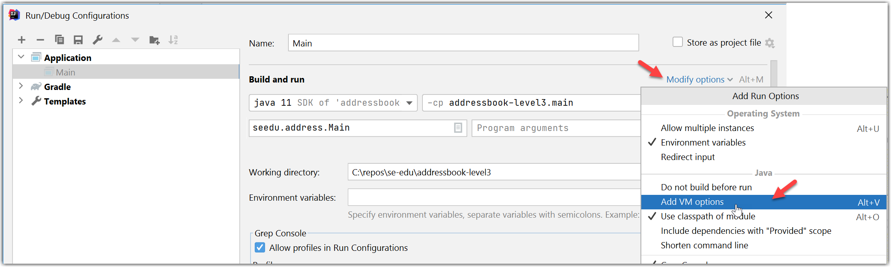


<frontmatter>
  title: "{{ title }}"
  pageNav: 2
</frontmatter>

# {{ title }}

<!-- ==================================================================================================== -->

## Enabling assertions

<box type="warning" seamless>

This tweak does not apply if you use Gradle to run code even within Intellij. In that case, refer to 'Enabling assertions' sections of the [_Gradle tutorial_](gradle.html#enabling-assertions).
</box>

1. Choose `Run` → `Edit Configurations...`.
1. Select the run configuration of interest.
1. Click on `Modify options` link and choose `Add VM options` 
   
1. Add `-ea` to the `VM options` box.
   

