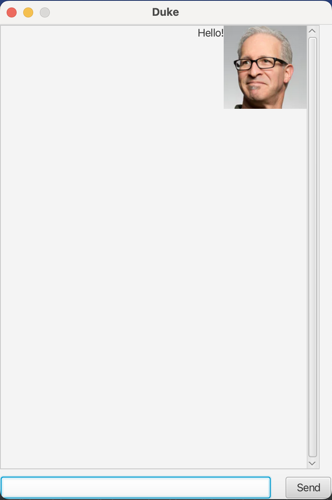

<frontmatter>
  title: "JavaFX tutorial part 2 - Creating a GUI for Duke"
  pageNav: 2
</frontmatter>

# JavaFX tutorial part 2 - Creating a GUI for Duke

In this tutorial, we will be creating a GUI for Duke from scratch based on the following mockup.


## JavaFX controls

Controls are reusable UI elements. Refer to the [JavaFX's official documentation](https://openjfx.io/javadoc/17/javafx.controls/javafx/scene/control/package-summary.html) for a list of controls available.
From the mockup above, can you identify the controls that we will need to use?

Mockup | Control
------ | :---: |
 | ImageView
 | Label
 | Button
 | TextField
 | ScrollPane | ScrollPane

{{ icon_tip }} You may be wondering why a `ScrollPane` is a `Control` and not a `Pane`, as its name suggests. `ScrollPane` extends the `Control` class in JavaFX because it represents a UI "widget" that the user directly interacts with (such as `Label`, `Button`, and `TextField`), whereas a `Pane` is a mere container that holds other components. Of course, a `ScrollPane` has the functionality of a container, allowing it to show a <tooltip content="gives a rectangular view into a larger content which exceeds the available screen/stage area">viewport</tooltip> of its content. `Scrollpane` contains one node, whereas a `Pane` can contain multiple nodes.

## Designing the Layout

Now that we know what controls we need to implement our UI, let’s start programming! We quickly run into a problem: how do we show all of them on the screen at once?

Each scene is initialized with a root `Node`. In the previous tutorial, our root `Node` was a `Label`.
What happens when we need to display more than one `Node` on the `Scene`? For that, we need to understand the JavaFX hierarchy. Recall from the previous tutorial:

<puml src="images/javafx/JavaFxHierarchy.puml" />

From the diagram, you see that the root `Node` can contain many other `Nodes` and similarly, each of those `Nodes` can contain many other `Nodes`. This means that if we can find a _container_ to set as our root `Node`, we can place all our other `Nodes` in it.

But how do we get the exact layout we want in the UI? JavaFX provides that functionality in the form of **layout panes** in `javafx.scene.layouts`. Each layout pane follows a _layout policy_ to decide how to arrange its children. For example, the `VBox` lays out its children in a single vertical column and its counterpart, the `HBox` lays out its children in a single horizontal row.

:bulb: A comprehensive list of layouts and how they behave is available here from the [official documentation](https://openjfx.io/javadoc/17/javafx.graphics/javafx/scene/layout/package-summary.html).

One way to obtain the layout in the mockup is as follows.

<puml>
@startuml
hide members
hide circle
skinparam shadowing false
skinparam ClassFontSize 16
skinparam ClassFontName Arial

class Stage
class AnchorPane
class ScrollPane
class VBox
class ImageView
class Label

AnchorPane -up-> Stage
ScrollPane -up-> AnchorPane

TextField -up-> AnchorPane
Button -up-> AnchorPane

VBox -up-> ScrollPane
ImageView -up-> VBox
Label -up-> VBox
@enduml
</puml>

This structure, when reflected on the actual Mockup UI, is as follows:


To get that layout, we create a new `AnchorPane` and add our controls to it. Similarly, we create a new `VBox` to hold the contents of the `ScrollPane`. The code should look something like this:

```java
import javafx.application.Application;
import javafx.scene.Scene;
import javafx.scene.control.Button;
import javafx.scene.control.ScrollPane;
import javafx.scene.control.TextField;
import javafx.scene.layout.AnchorPane;
import javafx.scene.layout.VBox;
import javafx.stage.Stage;


public class Duke extends Application {

    private ScrollPane scrollPane;
    private VBox dialogContainer;
    private TextField userInput;
    private Button sendButton;
    private Scene scene;

    public static void main(String[] args) {
        // ...
    }

    @Override
    public void start(Stage stage) {
         //Step 1. Setting up required components

         //The container for the content of the chat to scroll.
         scrollPane = new ScrollPane();
         dialogContainer = new VBox();
         scrollPane.setContent(dialogContainer);

         userInput = new TextField();
         sendButton = new Button("Send");

         AnchorPane mainLayout = new AnchorPane();
         mainLayout.getChildren().addAll(scrollPane, userInput, sendButton);

         scene = new Scene(mainLayout);

         stage.setScene(scene);
         stage.show();

         //More code to be added here later
    }
}
```
You might have noticed that the code above does not include the dialog boxes, which are HBoxes with a Label and an ImageView. For groups of components that are reused multiple times like this, it is often beneficial to create our own custom control. In the mockup of the UI, notice that the dialog boxes are composed of two different controls (`ImageView` and `Label`).

Let’s create our custom control `DialogBox` with these two components:
```java
import javafx.geometry.Pos;
import javafx.scene.control.Label;
import javafx.scene.image.Image;
import javafx.scene.image.ImageView;
import javafx.scene.layout.HBox;

public class DialogBox extends HBox {

    private Label text;
    private ImageView displayPicture;

    public DialogBox(String s, Image i) {
        text = new Label(s);
        displayPicture = new ImageView(i);
        text.setWrapText(true);
        displayPicture.setFitWidth(100.0);
        displayPicture.setFitHeight(100.0);
        
        this.setAlignment(Pos.TOP_RIGHT);
        
        this.getChildren().addAll(text, displayPicture);
    }
}
```
We use this control just like any other control. To have a dialog box in the scene, we need to create a new DialogBox instance and pass two elements to it: a String and an Image. For now, we can do this in `Duke.java`.

First, add these imports:

```java
import duke.ui.DialogBox;
import javafx.scene.control.Label;
import javafx.scene.image.Image;
import javafx.scene.image.ImageView;

```
Next, add two images to the `main/resources/images` folder.
For this tutorial, we have two images `DaUser.png` and `DaDuke.png` to represent the user avatar and Duke's avatar respectively but you can use any image you want.

Image|Filename
---|---
 | `DaUser.png`
 | `DaDuke.png`

Then, create an example DialogBox with a simple message.

```java
public class Duke extends Application {
    // ...
    private Image user = new Image(this.getClass().getResourceAsStream("/images/DaUser.png"));
    private Image duke = new Image(this.getClass().getResourceAsStream("/images/DaDuke.png"));
    // ...
    @Override
    public void start(Stage stage) {
       //...
       //This part is to be removed later
       String text = new Label("Hello!");
       DialogBox dialogBox = new DialogBox(text, user);
       dialogContainer.getChildren().addAll(dialogBox);
       //...
    }
}
```
<box type="important" seamless>

Note the image location (e.g., `/images/DaUser.png`) is given relative to the `main/resources` folder and there is a `/` in front. Follow the same for similar cases of using `getResourceAsStream` method in later parts of this tutorial.
</box>

Run the application and you should see something like this:


That is not what we were expecting, what did we forget to do?

## Styling the Controls

Almost every JavaFX object offer properties that you can set to customize its look and feel. For example, the `Stage` allows you to set its preferred size and title. Again, refer to the official JavaFX documentation for a comprehensive list of properties that you can modify. Here’s how you can get the application to look like the mockup:

Add the following code to the bottom of the `start` method. You'll have to add `import javafx.scene.layout.Region;` to the imports too.

```java
    @Override
    public void start(Stage stage) {
        //Step 1. Setting up required components

        //...

        //Step 2. Formatting the window to look as expected
        stage.setTitle("Duke");
        stage.setResizable(false);
        stage.setMinHeight(600.0);
        stage.setMinWidth(400.0);

        mainLayout.setPrefSize(400.0, 600.0);

        scrollPane.setPrefSize(385, 535);
        scrollPane.setHbarPolicy(ScrollPane.ScrollBarPolicy.NEVER);
        scrollPane.setVbarPolicy(ScrollPane.ScrollBarPolicy.ALWAYS);

        scrollPane.setVvalue(1.0);
        scrollPane.setFitToWidth(true);

        //You will need to import `javafx.scene.layout.Region` for this.
        dialogContainer.setPrefHeight(Region.USE_COMPUTED_SIZE);

        userInput.setPrefWidth(325.0);

        sendButton.setPrefWidth(55.0);

        AnchorPane.setTopAnchor(scrollPane, 1.0);

        AnchorPane.setBottomAnchor(sendButton, 1.0);
        AnchorPane.setRightAnchor(sendButton, 1.0);

        AnchorPane.setLeftAnchor(userInput , 1.0);
        AnchorPane.setBottomAnchor(userInput, 1.0);

        //More code to be added here later
    }
```
Style the `DialogBox` too:

```java
public DialogBox(Label l, ImageView iv) {
        text = l;
        displayPicture = iv;

        //styling the dialog box
        text.setWrapText(true);
        displayPicture.setFitWidth(100.0);
        displayPicture.setFitHeight(100.0);
        this.setAlignment(Pos.TOP_RIGHT);
        
        this.getChildren().addAll(text, displayPicture);
    }
```

Run the application again. It should now look like this:



## Exercises

1. In the tutorial, we used an `AnchorPane` to achieve the desired layout.
   1. Can you find other ways to obtain a similar layout?
   1. What are the advantages and disadvantages of your layout?

1. Try interacting with the application
   1. What happens when you press the `Enter` key or left-click the send button?
   1. Why?

[:fas-arrow-left: Previous](javaFxPart1.md) | [:fas-arrow-up: **ToC**](javaFx.md) | <span class="badge rounded-pill bg-primary">**++What's next?++**</span> [:fas-arrow-right: JavaFX tutorial part 3 - **Interacting with the user**](javaFxPart3.md)

--------------------------------------------------------------------------------
**Authors:**
* Initial Version: Jeffry Lum
