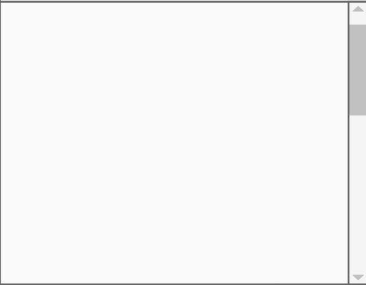

<frontmatter>
  title: "JavaFX tutorial part 2 - Creating a GUI for Duke"
  pageNav: 2
</frontmatter>

# JavaFX tutorial part 2 - Creating a GUI for Duke

In this part of the tutorial, we will be creating a GUI for Duke from scratch based on the following mockup.

<pic src="images/javafx/DukeMockup.png" width="450" />

## JavaFX controls

Controls are reusable UI elements. Refer to the [JavaFX's official documentation](https://openjfx.io/javadoc/17/javafx.controls/javafx/scene/control/package-summary.html) for a list of controls available.
From the mockup above, can you identify the controls that we will need to use?  Here they are:

Mockup | Control
------ | :---: |
 | ImageView
 | Label
 | Button
 | TextField
 | ScrollPane | ScrollPane

<box type="info" seamless>

 You may be wondering why a `ScrollPane` is a `Control` and not a `Pane`, as its name suggests. `ScrollPane` extends the `Control` class in JavaFX because it represents a UI "widget" that the user directly interacts with (such as `Label`, `Button`, and `TextField`), whereas a `Pane` is a mere container that holds other components. Of course, a `ScrollPane` has the functionality of a container, allowing it to show a <tooltip content="gives a rectangular view into a larger content which exceeds the available screen/stage area">viewport</tooltip> of its content. `ScrollPane` contains one node, whereas a `Pane` can contain multiple nodes.
</box>

## Designing the Layout

Now that we know what controls we need to implement our UI, let’s start programming! We quickly run into a problem: how do we show all of them on the screen at once?

Each scene is initialized with a root `Node`. In part 1 of the tutorial, our root `Node` was a `Label`.
What happens when we need to display more than one `Node` on the `Scene`? For that, we need to understand the JavaFX hierarchy. Recall from part 1:

<puml src="images/javafx/JavaFxHierarchy.puml" />

From the diagram, you see that the root `Node` can contain many other `Node`s and similarly, each of those `Node`s can contain many other `Node`s. This means that if we can find a _container_ to set as our root `Node`, we can place all our other `Node`s in it.

But how do we get the exact layout we want in the UI? JavaFX provides that functionality in the form of **layout panes** in `javafx.scene.layouts`. Each layout pane follows a _layout policy_ to decide how to arrange its children. For example, the `VBox` lays out its children in a single vertical column and its counterpart, the `HBox` lays out its children in a single horizontal row.

<box type="tip" seamless>

A comprehensive list of layouts and how they behave is available here from the [official documentation](https://openjfx.io/javadoc/17/javafx.graphics/javafx/scene/layout/package-summary.html).
</box>

One way to obtain the layout in the mockup is as follows:

<puml>
@startuml
hide members
hide circle
skinparam shadowing false
skinparam ClassFontSize 16
skinparam ClassFontName Arial

class Stage
class Scene
class AnchorPane
class ScrollPane
class VBox
class HBox
class ImageView
class Label

Scene -up-> Stage
AnchorPane -up-> Scene
ScrollPane -up-> AnchorPane

TextField -up-> AnchorPane
Button -up-> AnchorPane

VBox -up-> ScrollPane
HBox -up-> VBox
ImageView -up-> HBox
Label -up-> HBox
@enduml
</puml>

This structure, when reflected on the actual Mockup UI, is as follows:

<pic src="images/javafx/DukeMockupLabeled.png" width="450" />

To get that layout, we create a new `AnchorPane` and add our controls to it. Similarly, we create a new `VBox` to hold the contents of the `ScrollPane`. The code should look something like this:

```java{heading="Main.java"}
import javafx.application.Application;
import javafx.scene.Scene;
import javafx.scene.control.Button;
import javafx.scene.control.ScrollPane;
import javafx.scene.control.TextField;
import javafx.scene.layout.AnchorPane;
import javafx.scene.layout.VBox;
import javafx.stage.Stage;


public class Main extends Application {

    private ScrollPane scrollPane;
    private VBox dialogContainer;
    private TextField userInput;
    private Button sendButton;
    private Scene scene;

    @Override
    public void start(Stage stage) {
         //Setting up required components

         scrollPane = new ScrollPane();
         dialogContainer = new VBox();
         scrollPane.setContent(dialogContainer);

         userInput = new TextField();
         sendButton = new Button("Send");

         AnchorPane mainLayout = new AnchorPane();
         mainLayout.getChildren().addAll(scrollPane, userInput, sendButton);

         scene = new Scene(mainLayout);

         stage.setScene(scene);
         stage.show();

         //More code to be added here later
    }
}
```
You might have noticed that the code above does not include code for the dialog boxes (i.e., chat messages) -- a dialog box is an `HBox` containing an `ImageView` and a `Label`, as shown in the mockup of the UI given below.

<annotate src="images/javafx/DukeMockupLabeled.png" width="450">
<a-point x="79%" y="50%" content="dialog box" opacity="0.3" size="40" color="yellow"><span class="text-danger"><md>:fas-left-long: this is the **dialog box**</md></span></a-point>
</annotate>
<p/>

For groups of components that are reused multiple times like this, it is often beneficial to create our own custom control. Let’s create our custom control `DialogBox` with these two components:

```java{heading="DialogBox.java"}
import javafx.geometry.Pos;
import javafx.scene.control.Label;
import javafx.scene.image.Image;
import javafx.scene.image.ImageView;
import javafx.scene.layout.HBox;

public class DialogBox extends HBox {

    private Label text;
    private ImageView displayPicture;

    public DialogBox(String s, Image i) {
        text = new Label(s);
        displayPicture = new ImageView(i);
        this.getChildren().addAll(text, displayPicture);
    }
}
```
We use this control just like any other control. To have a dialog box in the scene, we need to create a new `DialogBox` instance and pass two elements to it: a `String` and an `Image`. For now, we can do this in `Main.java`.

First, add two images to the `main/resources/images` folder.
For this tutorial, we have two images `DaUser.png` and `DaDuke.png` to represent the user avatar and Duke's avatar respectively, but you can use any image you want.

Image|Filename
---|---
 | `DaUser.png`
 | `DaDuke.png`

Then, create a sample `DialogBox` with a simple message.

```java{highlight-lines="1, 5-6, 14-16" heading="Main.java"}
import javafx.scene.image.Image;

public class Main extends Application {
    // ...
    private Image userImage = new Image(this.getClass().getResourceAsStream("/images/DaUser.png"));
    private Image dukeImage = new Image(this.getClass().getResourceAsStream("/images/DaDuke.png"));
    // ...

    @Override
    public void start(Stage stage) {
        //...
        sendButton = new Button("Send");  // existing code

        DialogBox dialogBox = new DialogBox("Hello!", userImage);
        dialogContainer.getChildren().addAll(dialogBox);

        AnchorPane mainLayout = new AnchorPane();  // existing code
        //...
    }
}
```
<box type="important" seamless>

Note the image location (e.g., `/images/DaUser.png`) is given relative to the `main/resources` folder and there is a `/` in front. Do the same for similar cases of using `getResourceAsStream` method in later parts of this tutorial.
</box>

Run the application and you should see something like this:

<pic src="images/javafx/RawLayout.png" width="200" />

That is not what we were expecting, as the elements are not in the layout we wanted. Next, let's see how to fix that.

## Styling the Controls

Almost every JavaFX object offer properties that you can set to customize its look and feel. For example, the `Stage` allows you to set its preferred size and title. Again, refer to the official [JavaFX documentation](https://openjfx.io/javadoc/17/javafx.graphics/javafx/scene/layout/package-summary.html) for a comprehensive list of properties that you can modify. Here’s how you can get the application to look like the mockup:

Add the following code to the bottom of the `start` method. You'll have to add `import javafx.scene.layout.Region;` to the imports too:

```java{highlight-lines="1, 10-39" heading="Main.java"}
import javafx.scene.layout.Region;
// ...

    @Override
    public void start(Stage stage) {
        //Setting up required components

        //...

        //Formatting the window to look as expected

        stage.setTitle("Duke");
        stage.setResizable(false);
        stage.setMinHeight(600.0);
        stage.setMinWidth(400.0);

        mainLayout.setPrefSize(400.0, 600.0);

        scrollPane.setPrefSize(385, 535);
        scrollPane.setHbarPolicy(ScrollPane.ScrollBarPolicy.NEVER);
        scrollPane.setVbarPolicy(ScrollPane.ScrollBarPolicy.ALWAYS);

        scrollPane.setVvalue(1.0);
        scrollPane.setFitToWidth(true);

        dialogContainer.setPrefHeight(Region.USE_COMPUTED_SIZE);

        userInput.setPrefWidth(325.0);

        sendButton.setPrefWidth(55.0);

        AnchorPane.setTopAnchor(scrollPane, 1.0);

        AnchorPane.setBottomAnchor(sendButton, 1.0);
        AnchorPane.setRightAnchor(sendButton, 1.0);

        AnchorPane.setLeftAnchor(userInput, 1.0);
        AnchorPane.setBottomAnchor(userInput, 1.0);

        //More code to be added here later
    }
```

Style the `DialogBox` too:

```java{highlight-lines="5-9" heading="DialogBox.java"}
    public DialogBox(String s, Image i) {
        text = new Label(s);
        displayPicture = new ImageView(i);

        //Styling the dialog box
        text.setWrapText(true);
        displayPicture.setFitWidth(100.0);
        displayPicture.setFitHeight(100.0);
        this.setAlignment(Pos.TOP_RIGHT);

        this.getChildren().addAll(text, displayPicture);
    }
```

Run the application again. It should now look like this:

<pic src="images/javafx/FinalLayout.png" width="450"/>

<!--
## Exercises

1. In the tutorial, we used an `AnchorPane` to achieve the desired layout.
   1. Can you find other ways to obtain a similar layout?
   1. What are the advantages and disadvantages of your layout?
1. Try interacting with the application
   1. What happens when you press the <kbd>Enter</kbd> key or click the `Send` button?
   1. Why?
-->

[:fas-arrow-left: Previous](javaFxPart1.md) | [:fas-arrow-up: **ToC**](javaFx.md) | <span class="badge rounded-pill bg-primary">**++What's next?++**</span> [:fas-arrow-right: JavaFX tutorial part 3 - **Interacting with the user**](javaFxPart3.md)

--------------------------------------------------------------------------------
**Authors:**
* Initial Version: Jeffry Lum
