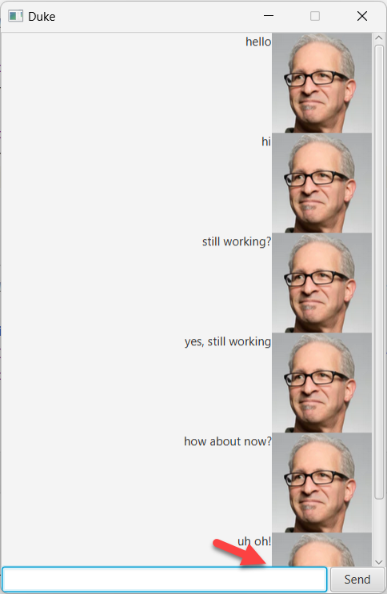
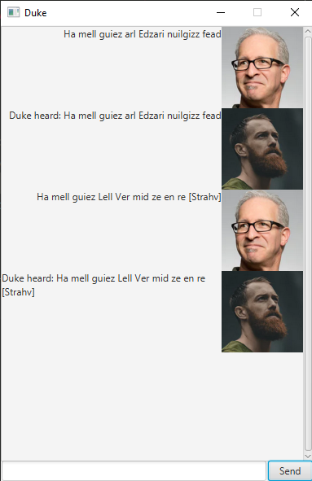

<frontmatter>
  title: "JavaFX tutorial part 3 – Interacting with the user"
  pageNav: 2
</frontmatter>

# JavaFX tutorial part 3 – Interacting with the user

Picking up from where we left off last tutorial, we have successfully achieved the desired layout. Now let’s make the application respond to user input. 

Rather than to do everything in one try, let’s iterate and build up towards our final goal. 

## Iteration 1 – Echoing the user

JavaFX has an _event-driven architecture style_. As such, we programmatically define _handler_ methods to execute as a response to certain _events_. When an event is detected, JavaFX will call the respective handlers.

For Duke, there are two events that we want to respond to, namely the user pressing `Enter` in the `TextField` and left-clicking the `Button`. These are the `onAction` event for the `TextField` and the `onMouseClicked` event for the `Button`.

For now, let’s have the application add a new `Label` with the text from the `TextField`. Update the `Main` class as follows. You'll need to add an `import javafx.scene.control.Label;` too.
```java
@Override
public void start(Stage stage) {
    // Step 1 code here

    //Step 2 code here

    //Step 3. Add functionality to handle user input.
    sendButton.setOnMouseClicked((event) -> {
        dialogContainer.getChildren().add(getDialogLabel(userInput.getText()));
        userInput.clear();
    });
    
    userInput.setOnAction((event) -> {
        dialogContainer.getChildren().add(getDialogLabel(userInput.getText()));
        userInput.clear();
    });
}

/**
 * Iteration 1:
 * Creates a label with the specified text and adds it to the dialog container.
 * @param text String containing text to add
 * @return a label with the specified text that has word wrap enabled.
 */
private Label getDialogLabel(String text) {
    // You will need to import `javafx.scene.control.Label`.
    Label textToAdd = new Label(text);
    textToAdd.setWrapText(true);

    return textToAdd;
}
```

Run the program and give it a whirl!



At first glance everything appears to work perfectly. However, when the `VBox` stretches beyond the confines of the `ScrollPane`, the `ScrollPane` does not scroll down automatically as expected. We can remedy this by attaching a handler on the `VBox` to react to its own size changing and scrolling the `ScrollPane` down.

Update the `start` method as shown below.

```java
public void start(Stage stage) {
    // current code ...
 
    //Scroll down to the end every time dialogContainer's height changes.
    dialogContainer.heightProperty().addListener((observable) -> scrollPane.setVvalue(1.0));
}
```

Verify that the `ScrollPane` scrolls as intended.

## Iteration 2 – Adding Dialog Boxes

In the mockup of the UI, notice that the dialog boxes are composed of two different controls (`ImageView` and `Label`) and reused multiple times. In situations like this, it is often beneficial to create our own custom control.

Let’s create our custom control `DialogBox`:
```java
import javafx.geometry.Pos;
import javafx.scene.control.Label;
import javafx.scene.image.ImageView;
import javafx.scene.layout.HBox;

public class DialogBox extends HBox {

    private Label text;
    private ImageView displayPicture;

    public DialogBox(Label l, ImageView iv) {
        text = l;
        displayPicture = iv;

        text.setWrapText(true);
        displayPicture.setFitWidth(100.0);
        displayPicture.setFitHeight(100.0);

        this.setAlignment(Pos.TOP_RIGHT);
        this.getChildren().addAll(text, displayPicture);
    }
}
```

We use the code in our main class just like any other control. Here are the steps to update the code to use the custom control in `Main.java`.

First, add these imports:
```java
import javafx.scene.image.Image;
import javafx.scene.image.ImageView;
```

Next, add two images to the `main/resources/images` folder.
For this tutorial, we have two images `DaUser.png` and `DaDuke.png` to represent the user avatar and Duke's avatar respectively but you can use any image you want.

Image|Filename
---|---
 | `DaUser.png`
 | `DaDuke.png`


```java
public class Duke extends Application {
    // ...
    private Image user = new Image(this.getClass().getResourceAsStream("/images/DaUser.png"));
    private Image duke = new Image(this.getClass().getResourceAsStream("/images/DaDuke.png"));
    // ...
}
```

Add a new method to handle user input:
```java
/**
 * Iteration 2:
 * Creates two dialog boxes, one echoing user input and the other containing Duke's reply and then appends them to
 * the dialog container. Clears the user input after processing.
 */
private void handleUserInput() {
    Label userText = new Label(userInput.getText());
    Label dukeText = new Label(getResponse(userInput.getText()));
    dialogContainer.getChildren().addAll(
            new DialogBox(userText, new ImageView(user)),
            new DialogBox(dukeText, new ImageView(duke))
    );
    userInput.clear();
}

/**
 * You should have your own function to generate a response to user input.
 * Replace this stub with your completed method.
 */
private String getResponse(String input) {
    return "Duke heard: " + input;
}
```

Update the event handler code in the `start` method to use the new `handleUserInput` method:
```java

@Override
public void start(Stage stage) {
    //...

    //Part 3. Add functionality to handle user input.
    sendButton.setOnMouseClicked((event) -> {
        handleUserInput();
    });

    userInput.setOnAction((event) -> {
        handleUserInput();
    });
}
```

Run the program and see how it works.

 

## Iteration 3 – Adding custom behavior to DialogBox

One additional benefit of defining a custom control is that we can add behavior specific to our `DialogBox`. Let’s add a method to flip a dialog box such that the image on the left to differentiate between user input and Duke’s output.

```java
/**
 * Flips the dialog box such that the ImageView is on the left and text on the right.
 */
private void flip() {
    this.setAlignment(Pos.TOP_LEFT);
    ObservableList<Node> tmp = FXCollections.observableArrayList(this.getChildren());
    FXCollections.reverse(tmp);
    this.getChildren().setAll(tmp);
}

public static DialogBox getUserDialog(Label l, ImageView iv) {
    return new DialogBox(l, iv);
}

public static DialogBox getDukeDialog(Label l, ImageView iv) {
    var db = new DialogBox(l, iv);
    db.flip();
    return db;
}
```

You'll need to update the imports as follows:
```java
import javafx.collections.FXCollections;
import javafx.collections.ObservableList;
import javafx.geometry.Pos;
import javafx.scene.Node;
import javafx.scene.control.Label;
import javafx.scene.image.ImageView;
import javafx.scene.layout.HBox;
```

Now, we can go back to the `Main` class and change the event handler to use our new `DialogBox`. 

```java
private void handleUserInput() {
    Label userText = new Label(userInput.getText());
    Label dukeText = new Label(getResponse(userInput.getText()));
    dialogContainer.getChildren().addAll(
            DialogBox.getUserDialog(userText, new ImageView(user)),
            DialogBox.getDukeDialog(dukeText, new ImageView(duke))
    );
    userInput.clear();
}
```

Run the application and play around with it. 


Congratulations! 
You have successfully implemented a fully functional GUI for Duke!  

## Exercises

1. While the GUI looks similar to the mockup, there are still parts that need to be refined. Try your hand at some of these tasks:
   * Add padding between each DialogBox
   * Add padding between each ImageView and its Label
   * Clip the ImageView into a circle
   * Add background color to each dialog box

1. After attempting the changes, reflect critically on the following:
   * What was the development workflow like?
   * Is the code base well-organized?

[:fas-arrow-left: Previous](javaFxPart2.md) | [:fas-arrow-up: **ToC**](javaFx.md) | <span class="badge badge-pill badge-primary">**++What's next?++**</span> [:fas-arrow-right: JavaFX tutorial part 4 - **Using FXML**](javaFxPart4.md)

--------------------------------------------------------------------------------
**Authors:**
* Initial Version: Jeffry Lum
