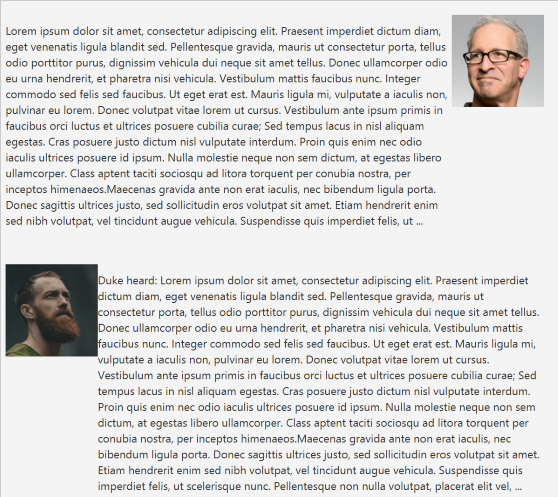

<frontmatter>
  title: "JavaFX tutorial part 4 – Using FXML"
  pageNav: 2
</frontmatter>

# JavaFX tutorial part 4 – Using FXML

While we have produced a fully functional prototype in part 3, there are some problems with the way we implemented it, using Java code alone:

**Problem 1:** The `Main` class attempts to do it all. Code for visual tweaks, listeners and even utility methods are all in one file. This makes it difficult to find and make changes to existing code.<br>
**A possible solution:** An alternative approach (to hand-coding everything) is to use FXML -- an XML-based language that allows us to define UIs. Properties of JavaFX objects can be defined in the FXML file. For example consider the following FXML snippet that defines a `TextField` similar to the one that we programmatically defined previous in part 2:
```xml
 <TextField fx:id="userInput"
            layoutY="558.0"
            onAction="#handleUserInput"
            prefHeight="41.0"
            prefWidth="324.0"
            AnchorPane.bottomAnchor="1.0" />
```
Notice how concise FXML is compared to the plain Java version.

**Problem 2:** The process of visually enhancing the GUI is long and painful. Every small change requires us to rebuild and run the application, just to see if the change gave the result we wanted.<br>
**A possible solution:** Once we switch over to using FXML, we can use a tool such as Scene Builder (a tool developed by Oracle and currently maintained by Gluon) to inspect and tweak the GUI design in a <tooltip content="What-You-See-Is-What-You-Get">WYSIWYG</tooltip> fashion.

Let's return to Duke and convert it to use FXML instead, and give Scene Builder a try as well.

## Refactor Duke to use FXML

FXML allows you to separate the GUI design (the so-called _view_), from the code that controls the GUI (the so-called _controllers_). First, lets extract out a `MainWindow` class to contain the _controller_ aspect of the main GUI:

```java{heading="MainWindow.java"}
import javafx.fxml.FXML;
import javafx.scene.control.Button;
import javafx.scene.control.ScrollPane;
import javafx.scene.control.TextField;
import javafx.scene.image.Image;
import javafx.scene.layout.AnchorPane;
import javafx.scene.layout.VBox;
/**
 * Controller for the main GUI.
 */
public class MainWindow extends AnchorPane {
    @FXML
    private ScrollPane scrollPane;
    @FXML
    private VBox dialogContainer;
    @FXML
    private TextField userInput;
    @FXML
    private Button sendButton;

    private Duke duke;

    private Image userImage = new Image(this.getClass().getResourceAsStream("/images/DaUser.png"));
    private Image dukeImage = new Image(this.getClass().getResourceAsStream("/images/DaDuke.png"));

    @FXML
    public void initialize() {
        scrollPane.vvalueProperty().bind(dialogContainer.heightProperty());
    }

    /** Injects the Duke instance */
    public void setDuke(Duke d) {
        duke = d;
    }

    /**
     * Creates two dialog boxes, one echoing user input and the other containing Duke's reply and then appends them to
     * the dialog container. Clears the user input after processing.
     */
    @FXML
    private void handleUserInput() {
        String input = userInput.getText();
        String response = duke.getResponse(input);
        dialogContainer.getChildren().addAll(
                DialogBox.getUserDialog(input, userImage),
                DialogBox.getDukeDialog(response, dukeImage)
        );
        userInput.clear();
    }
}
```

To go with the above, let's extract out the _view_ aspect into an FXML file `MainWindow.fxml`, to be placed in `src/main/resources/view/`:

```xml{highlight-lines="14['fx:controller'],16['userInput'],18['#handleUserInput']" heading="MainWindow.fxml"}
<?xml version="1.0" encoding="UTF-8"?>

<?import javafx.scene.control.Button?>
<?import javafx.scene.control.ScrollPane?>
<?import javafx.scene.control.TextField?>
<?import javafx.scene.layout.AnchorPane?>
<?import javafx.scene.layout.VBox?>

<AnchorPane maxHeight="-Infinity" maxWidth="-Infinity"
            minHeight="-Infinity" minWidth="-Infinity"
            prefHeight="600.0" prefWidth="400.0"
            xmlns="http://javafx.com/javafx/17"
            xmlns:fx="http://javafx.com/fxml/1"
            fx:controller="MainWindow">
    <children>
        <TextField fx:id="userInput"
                   layoutY="558.0"
                   onAction="#handleUserInput"
                   prefHeight="41.0"
                   prefWidth="324.0"
                   AnchorPane.bottomAnchor="1.0" />
        <Button fx:id="sendButton"
                layoutX="324.0"
                layoutY="558.0"
                mnemonicParsing="false"
                onAction="#handleUserInput"
                prefHeight="41.0"
                prefWidth="76.0"
                text="Send" />
        <ScrollPane fx:id="scrollPane"
                    hbarPolicy="NEVER"
                    hvalue="1.0"
                    prefHeight="557.0"
                    prefWidth="400.0"
                    vvalue="1.0">
            <content>
                <VBox fx:id="dialogContainer"
                      prefHeight="552.0"
                      prefWidth="388.0" />
            </content>
        </ScrollPane>
    </children>
</AnchorPane>

```

<box type="important" seamless>

Note that if you are using packages, `fx:controller="MainWindow"` needs to be updated accordingly e.g., `fx:controller="seedu.duke.MainWindow"`
</box>

The `@FXML` annotation (seen in `MainWindow.java`) marks a `private` or `protected` member and makes it accessible to FXML despite its modifier.
Without the annotation, we will have to make everything `public` and expose our UI to unwanted changes.
Even private methods like `handleUserInput` can be referenced from an FXML file when annotated by `@FXML`.

The FXML runtime will map a control with a `fx:id` defined in FXML to a variable with the same name in its controller.
Notice how in `MainWindow`, we can invoke `userInput.clear()` just as we did in the previous non-FXML version of Duke (this is enabled by the `<TextField fx:id="userInput" ... />` in the `MainWindow.fxml`).

Similarly, let's create an FXML file for the `DialogBox` (to be placed in `src/main/resources/view/`):

```xml{heading="DialogBox.fxml"}
<?xml version="1.0" encoding="UTF-8"?>

<?import javafx.geometry.Insets?>
<?import javafx.scene.control.Label?>
<?import javafx.scene.image.ImageView?>
<?import javafx.scene.layout.HBox?>

<fx:root alignment="TOP_RIGHT"
         maxHeight="1.7976931348623157E308"
         maxWidth="1.7976931348623157E308"
         prefWidth="400.0"
         type="javafx.scene.layout.HBox"
         xmlns="http://javafx.com/javafx/17"
         xmlns:fx="http://javafx.com/fxml/1">
  <children>
    <Label fx:id="dialog" text="Label" wrapText="true" minHeight="-Infinity"/>
    <ImageView fx:id="displayPicture" fitHeight="99.0" fitWidth="99.0" pickOnBounds="true" preserveRatio="true" />
  </children>
  <padding>
    <Insets bottom="15.0" left="5.0" right="5.0" top="15.0" />
  </padding>
</fx:root>
```
<box type="info" seamless>

Note that for `Label`, we set `wrapText` to **true** and `minHeight` to **-Infinity**. This configuration wraps the text within the label, removes the minimum height constraint, and allows the label to grow vertically as needed:


Without setting `minHeight` to **-Infinity**, text overrun may occur when the text to be displayed exceeds the size of the label, causing the text to not be fully displayed and ends with `...` instead:



</box>

With that, we can trim down the `DialogBox.java` to contain only the _controller_ aspect:

```java{heading="DialogBox.java"}
import java.io.IOException;
import java.util.Collections;

import javafx.collections.FXCollections;
import javafx.collections.ObservableList;
import javafx.fxml.FXML;
import javafx.fxml.FXMLLoader;
import javafx.geometry.Pos;
import javafx.scene.Node;
import javafx.scene.control.Label;
import javafx.scene.image.Image;
import javafx.scene.image.ImageView;
import javafx.scene.layout.HBox;

/**
 * Represents a dialog box consisting of an ImageView to represent the speaker's face
 * and a label containing text from the speaker.
 */
public class DialogBox extends HBox {
    @FXML
    private Label dialog;
    @FXML
    private ImageView displayPicture;

    private DialogBox(String text, Image img) {
        try {
            FXMLLoader fxmlLoader = new FXMLLoader(MainWindow.class.getResource("/view/DialogBox.fxml"));
            fxmlLoader.setController(this);
            fxmlLoader.setRoot(this);
            fxmlLoader.load();
        } catch (IOException e) {
            e.printStackTrace();
        }

        dialog.setText(text);
        displayPicture.setImage(img);
    }

    /**
     * Flips the dialog box such that the ImageView is on the left and text on the right.
     */
    private void flip() {
        ObservableList<Node> tmp = FXCollections.observableArrayList(this.getChildren());
        Collections.reverse(tmp);
        getChildren().setAll(tmp);
        setAlignment(Pos.TOP_LEFT);
    }

    public static DialogBox getUserDialog(String text, Image img) {
        return new DialogBox(text, img);
    }

    public static DialogBox getDukeDialog(String text, Image img) {
        var db = new DialogBox(text, img);
        db.flip();
        return db;
    }
}
```

When we create a new instance of `DialogBox` (i.e., in the `DialogBox` constructor), we set both the controller and root `Node` to `DialogBox`. From this point onwards we can interact with `DialogBox` as we did in the non-FXML verison of Duke. Note that this is another way of connecting up the fxml view file with the Java controller file (different from the `fx:controller` technique we used to link up the `MainWindow.fxml` with the `MainWindow.java`).

All that remains to do now is to trim the `Main` class, as follows:

```java{heading="Main.java"}
import java.io.IOException;

import javafx.application.Application;
import javafx.fxml.FXMLLoader;
import javafx.scene.Scene;
import javafx.scene.layout.AnchorPane;
import javafx.stage.Stage;

/**
 * A GUI for Duke using FXML.
 */
public class Main extends Application {

    private Duke duke = new Duke();

    @Override
    public void start(Stage stage) {
        try {
            FXMLLoader fxmlLoader = new FXMLLoader(Main.class.getResource("/view/MainWindow.fxml"));
            AnchorPane ap = fxmlLoader.load();
            Scene scene = new Scene(ap);
            stage.setScene(scene);
            fxmlLoader.<MainWindow>getController().setDuke(duke);  // inject the Duke instance
            stage.show();
        } catch (IOException e) {
            e.printStackTrace();
        }
    }
}
```

Again, we can interact with the `AnchorPane` defined in the FXML as we would have if we created the `AnchorPane` ourselves inside the `Main` class.

Run the application to verify it works as before.

From the above refactoring, you can see how we can use FXML to separate _view_ and _controller_ aspects into separate files, and how FXML files and matching Java files can still refer each other's elements.

## Using Scene Builder to tweak the GUI

Next, let us explore how we can use the Scene Builder tool to tweak the GUI visually. [Download](https://gluonhq.com/products/scene-builder/#download) the appropriate version for your OS and install it.

1. Let’s use Scene Builder to explore FXML files we created earlier.
    
    Running Scene Builder brings up the main screen.
    Select `Open Project` > `src/main/resources/view/MainWindow.fxml`. Inspect each control and its properties.

   

1. On the right accordion pane, you can modify the properties of the control that you have selected. Try changing the various settings and see what they do!

   <box type="info" seamless>

   Note that when you change something in Scene Builder and saves it, Scene Builder will change the JavaFX version in the `.fxml` file to the latest JavaFX. Example:
   ```diff {heading="MainWindow.fxml"}
   - <fx:root ... xmlns="http://javafx.com/javafx/17" ... ">
   + <fx:root ... xmlns="http://javafx.com/javafx/22" ... ">
   ```
   This will cause a version incompatibility warning when you run the application. As a workaround, you can manually change back the version to the original value after you are done tweaking the UI.
   </box>
 
1. On the left accordion, when you expand the `Controller` panel at the bottom, you can see that we have set the controller class to `MainWindow`.
 
   

1. Let’s now open `DialogBox.fxml` in Scene Builder (open it the same way you opened the previous file), and expand the `Controller` panel on the left-side accordion.<br>
   <br>
   The main difference you can see here is that DialogBox ticks `Use fx:root construct` and _does not define a controller class_. Ticking this enables the use of the `fx:root` element, allowing you to reference a root element, which can be set by calling the `setRoot()` method. The controller (which is shown as empty) can be programmatically set using the `setController()` method. This is exactly what we did in the constructor of the `DialogBox.java` earlier.
   ```java{highlight-lines="4-5" heading="DialogBox.java"}
       private DialogBox(String text, Image img) {
            try {
                FXMLLoader fxmlLoader = new FXMLLoader(MainWindow.class.getResource("/view/DialogBox.fxml"));
                fxmlLoader.setController(this);
                fxmlLoader.setRoot(this);
                fxmlLoader.load();
            } catch (IOException e) {
                e.printStackTrace();
            }

            dialog.setText(text);
            displayPicture.setImage(img);
       }
   ```
   
   More about `fx:root` on the documentation [Introduction to FXML | JavaFX 2.2](https://docs.oracle.com/javafx/2/api/javafx/fxml/doc-files/introduction_to_fxml.html#root_elements).

<!--
## Exercises

1. Convert `MainWindow` to use the `fx:root` construct.
1. Extend `MainWindow` to have a `Stage` as a root Node.
1. Customize the appearance of the application further with CSS.
-->

[:fas-arrow-left: Previous](javaFxPart3.md) | [:fas-arrow-up: **ToC**](javaFx.md) | <span class="badge rounded-pill bg-primary">**++What's next?++**</span> [:fas-arrow-right: JavaFX tutorial part 5 - **Tweaking the GUI**](javaFxPart5.md)

--------------------------------------------------------------------------------
**Authors:**
* Initial Version: Jeffry Lum
