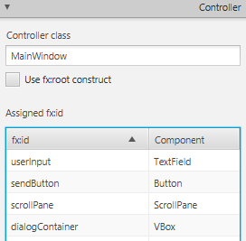

<frontmatter>
  title: "JavaFX tutorial part 4 – Using FXML"
  pageNav: 2
</frontmatter>

# JavaFX tutorial part 4 – Using FXML

While we have produced a fully functional prototype, there are a few major problems with our application.

1. The process of visually enhancing the GUI is long and painful:
   * Does the `TextField` need to be 330px or 325px wide? 
   * How much padding is enough padding to look good?

   Every small change requires us to rebuild and run the application.  

1. Components are heavily dependent on each other:
   Why does `Main` need to know that `DialogBox` needs a `Label`? 
   What happens if we change the `Label` to a custom `ColoredLabel` in the future?  
    
    We need to minimize the amount of information each control needs to know about another.
    Otherwise, making changes in the future will break existing features.

1. The code is untidy and long:
   Why is all the code in one place?

   The `Main` class attempts to do it all. 
   Code for visual tweaks, listeners and even utility methods are all in one file.
   This makes it difficult to find and make changes to existing code.

FXML is a XML-based language that allows us to define our user interface. Properties of JavaFX objects can be defined in the FXML file. For example:  
```xml
 <TextField fx:id="userInput" layoutY="558.0" onAction="#handleUserInput" prefHeight="41.0" prefWidth="324.0" AnchorPane.bottomAnchor="1.0" />
```

The FXML snippet define a TextField similar to the one that we programmatically defined previous in Tutorial 2. Notice how concise FXML is compared to the plain Java version.

Let's return to Duke and convert it to use FXML instead.

# Rebuilding the Scene using FXML

Scene Builder is a tool developed by Oracle and currently maintained by Gluon. It is a What-You-See-Is-What-You-Get GUI creation tool. [Download](https://gluonhq.com/products/scene-builder/#download) the appropriate version for your OS and install it.

Create the following files in `src/main/resources/view`:

**MainWindow.fxml**
```xml
<?xml version="1.0" encoding="UTF-8"?>

<?import javafx.scene.control.Button?>
<?import javafx.scene.control.ScrollPane?>
<?import javafx.scene.control.TextField?>
<?import javafx.scene.layout.AnchorPane?>
<?import javafx.scene.layout.VBox?>

<AnchorPane maxHeight="-Infinity" maxWidth="-Infinity" minHeight="-Infinity" minWidth="-Infinity" prefHeight="600.0" prefWidth="400.0" xmlns="http://javafx.com/javafx/17" xmlns:fx="http://javafx.com/fxml/1" fx:controller="MainWindow">
  <children>
    <TextField fx:id="userInput" layoutY="558.0" onAction="#handleUserInput" prefHeight="41.0" prefWidth="324.0" AnchorPane.bottomAnchor="1.0" />
    <Button fx:id="sendButton" layoutX="324.0" layoutY="558.0" mnemonicParsing="false" onAction="#handleUserInput" prefHeight="41.0" prefWidth="76.0" text="Send" />
    <ScrollPane fx:id="scrollPane" hbarPolicy="NEVER" hvalue="1.0" prefHeight="557.0" prefWidth="400.0" vvalue="1.0">
      <content>
        <VBox fx:id="dialogContainer" prefHeight="552.0" prefWidth="388.0" />
      </content>
    </ScrollPane>
  </children>
</AnchorPane>
```

<box type="important" seamless>

Note that if you are using packages, `fx:controller="MainWindow"` needs to be updated accordingly e.g., `fx:controller="seedu.duke.MainWindow"`
</box>

**DialogBox.fxml**
```xml
<?xml version="1.0" encoding="UTF-8"?>

<?import javafx.geometry.Insets?>
<?import javafx.scene.control.Label?>
<?import javafx.scene.image.ImageView?>
<?import javafx.scene.layout.HBox?>

<fx:root alignment="TOP_RIGHT" maxHeight="1.7976931348623157E308" maxWidth="1.7976931348623157E308" prefWidth="400.0" type="javafx.scene.layout.HBox" xmlns="http://javafx.com/javafx/17" xmlns:fx="http://javafx.com/fxml/1">
  <children>
    <Label fx:id="dialog" text="Label" wrapText="true" />
    <ImageView fx:id="displayPicture" fitHeight="99.0" fitWidth="99.0" pickOnBounds="true" preserveRatio="true" />
  </children>
  <padding>
    <Insets bottom="15.0" left="5.0" right="5.0" top="15.0" />
  </padding>
</fx:root>
```

1. Let’s explore the provided FXML files in Scene Builder. 
    
    Running the tool brings up the main screen.
    Select `Open Project` > `src/main/resources/view/MainWindow.fxml`. Inspect each control and its properties.

   

1. On the right accordion pane, you can modify the properties of the control that you have selected. Try changing the various settings and see what they do!
 
1. On the left accordion, you can see that we have set the controller class to `MainWindow`. 
We will get to that later.
 
   

1. Let’s repeat the process for `DialogBox`.
   The main difference here is that DialogBox checks `Use fx:root construct` and _does not define a controller class_. Checking this enables the use of the `fx:root` element, allowing you to reference a predefined root element. More about `fx:root` on the documentation [Introduction to FXML | JavaFX 2.2](https://docs.oracle.com/javafx/2/api/javafx/fxml/doc-files/introduction_to_fxml.html#root_elements).

   

## Using Controllers

As part of the effort to separate the code handling Duke's logic and UI, let's _refactor_ the UI-related code to its own class.
We call these UI classes _controllers_. 

Let's implement the `MainWindow` controller class that we specified in `MainWindow.fxml`.

**MainWindow.java**
```java
import javafx.fxml.FXML;
import javafx.scene.control.Button;
import javafx.scene.control.ScrollPane;
import javafx.scene.control.TextField;
import javafx.scene.image.Image;
import javafx.scene.layout.AnchorPane;
import javafx.scene.layout.VBox;
/**
 * Controller for MainWindow. Provides the layout for the other controls.
 */
public class MainWindow extends AnchorPane {
    @FXML
    private ScrollPane scrollPane;
    @FXML
    private VBox dialogContainer;
    @FXML
    private TextField userInput;
    @FXML
    private Button sendButton;

    private Duke duke;

    private Image userImage = new Image(this.getClass().getResourceAsStream("/images/DaUser.png"));
    private Image dukeImage = new Image(this.getClass().getResourceAsStream("/images/DaDuke.png"));

    @FXML
    public void initialize() {
        scrollPane.vvalueProperty().bind(dialogContainer.heightProperty());
    }

    public void setDuke(Duke d) {
        duke = d;
    }

    /**
     * Creates two dialog boxes, one echoing user input and the other containing Duke's reply and then appends them to
     * the dialog container. Clears the user input after processing.
     */
    @FXML
    private void handleUserInput() {
        String input = userInput.getText();
        String response = duke.getResponse(input);
        dialogContainer.getChildren().addAll(
                DialogBox.getUserDialog(input, userImage),
                DialogBox.getDukeDialog(response, dukeImage)
        );
        userInput.clear();
    }
}
```

The `@FXML` annotation marks a `private` or `protected` member and makes it accessible to FXML despite its modifier.
Without the annotation, we will have to make everything `public` and expose our UI to unwanted changes.

The `FXMLLoader` will map a control with a `fx:id` defined in FXML to a variable with the same name in its controller.
Notice how in `MainWindow`, we can invoke `TextField#clear()` on `userInput` and access its content just as we did in the previous example.
Similarly, methods like private methods like `handleUserInput` can be used in FXML when annotated by `@FXML`. 

## Using FXML in our application

Let's create a new `Main` class as the bridge between the existing logic in `Duke` and the UI in `MainWindow`.

**Main.java**
```java
import java.io.IOException;

import javafx.application.Application;
import javafx.fxml.FXMLLoader;
import javafx.scene.Scene;
import javafx.scene.layout.AnchorPane;
import javafx.stage.Stage;

/**
 * A GUI for Duke using FXML.
 */
public class Main extends Application {

    private Duke duke = new Duke();

    @Override
    public void start(Stage stage) {
        try {
            FXMLLoader fxmlLoader = new FXMLLoader(Main.class.getResource("/view/MainWindow.fxml"));
            AnchorPane ap = fxmlLoader.load();
            Scene scene = new Scene(ap);
            stage.setScene(scene);
            fxmlLoader.<MainWindow>getController().setDuke(duke);
            stage.show();
        } catch (IOException e) {
            e.printStackTrace();
        }
    }
}
```

Again, we can interact with the `AnchorPane` defined in the FXML as we would have if we created the `AnchorPane` ourselves.

For our custom `DialogBox`, we did not define a controller so let's create a controller for it.

**DialogBox.java**
```java
import java.io.IOException;
import java.util.Collections;

import javafx.collections.FXCollections;
import javafx.collections.ObservableList;
import javafx.fxml.FXML;
import javafx.fxml.FXMLLoader;
import javafx.geometry.Pos;
import javafx.scene.Node;
import javafx.scene.control.Label;
import javafx.scene.image.Image;
import javafx.scene.image.ImageView;
import javafx.scene.layout.HBox;

/**
 * An example of a custom control using FXML.
 * This control represents a dialog box consisting of an ImageView to represent the speaker's face and a label
 * containing text from the speaker.
 */
public class DialogBox extends HBox {
    @FXML
    private Label dialog;
    @FXML
    private ImageView displayPicture;

    private DialogBox(String text, Image img) {
        try {
            FXMLLoader fxmlLoader = new FXMLLoader(MainWindow.class.getResource("/view/DialogBox.fxml"));
            fxmlLoader.setController(this);
            fxmlLoader.setRoot(this);
            fxmlLoader.load();
        } catch (IOException e) {
            e.printStackTrace();
        }

        dialog.setText(text);
        displayPicture.setImage(img);
    }

    /**
     * Flips the dialog box such that the ImageView is on the left and text on the right.
     */
    private void flip() {
        ObservableList<Node> tmp = FXCollections.observableArrayList(this.getChildren());
        Collections.reverse(tmp);
        getChildren().setAll(tmp);
        setAlignment(Pos.TOP_LEFT);
    }

    public static DialogBox getUserDialog(String text, Image img) {
        return new DialogBox(text, img);
    }

    public static DialogBox getDukeDialog(String text, Image img) {
        var db = new DialogBox(text, img);
        db.flip();
        return db;
    }
}
```

When we create a new instance of `DialogBox`, we set both the controller and root Node to `DialogBox`. 
From this point onwards we can interact with `DialogBox` as we have in the previous tutorials.

The last change that we have to make is to point our `Launcher` class in the right direction:
In `Launcher.java`
```java
//...    
Application.launch(Main.class, args);
//...
```
[todo]: # (Discussion on the fx:root pattern.)

## Exercises

1. Convert `MainWindow` to use the `fx:root` construct.
1. Extend `MainWindow` to have a `Stage` as a root Node.
1. Customize the appearance of the application further with CSS.

[:fas-arrow-left: Previous](javaFxPart3.md) | [:fas-arrow-up: **ToC**](javaFx.md) | <span class="badge rounded-pill bg-primary">**++What's next?++**</span> [:fas-arrow-right: JavaFX tutorial part 5 - **Tweaking the GUI**](javaFxPart5.md)

--------------------------------------------------------------------------------
**Authors:**
* Initial Version: Jeffry Lum

