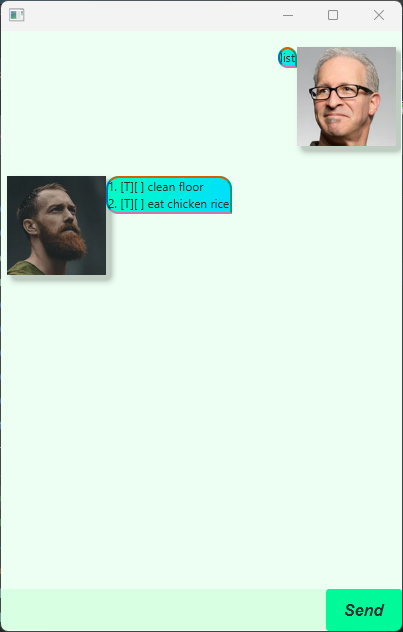
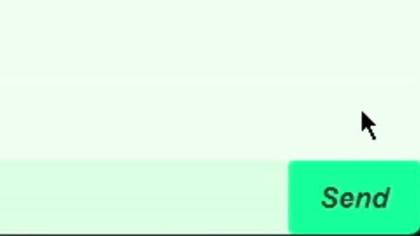

<frontmatter>
  title: "JavaFX tutorial part 5 – Tweaking the GUI"
  pageNav: 2
</frontmatter>

# JavaFX tutorial part 5 – Tweaking the GUI

This guide aims to help shorten the amount of time needed to learn some of the layout/CSS related stuff so that you may
focus more on designing your own GUI.

# Setting the dimensions

As you may have noticed, some of the boxes does not follow the dimension of the app.

To rectify this, we can use a mixture of the following two techniques:
1) [Automatically anchor nodes](#automatically-anchor-nodes)
2) [Set limit to window dimensions](#setting-limit-to-window-size)


## Automatically Anchor Nodes

We want to [anchor](https://docs.oracle.com/javase/8/javafx/api/javafx/scene/layout/AnchorPane.html) the following nodes:
- Anchor `TextField` to the bottom while also automatically resize horizontally
- Anchor Send Button to the bottom right of the app
- Anchor the `ScrollPane` to resize both horizontally and vertically

### Automatically Anchor TextField
Open `src/main/resources/view/MainWindow.fxml` in SceneBuilder and click on `TextField`. On the right accordion pane you
should be able to see the AnchorPane constraints of the `TextField`.


Children within `AnchorPane` are able to "anchor" their edges to the `AnchorPane` itself if a constraint is set.

Since we want to automatically resize the `TextField` whenever we resize the window, we need to put an anchor
constraint on the **left and right edges**. Click on the left and right boxes as shown below, and it will automatically
set a value based on its current position relative to the AnchorPane. Note that the right side is set to 76 as this is
the width of the button next to it.


### Automatically Anchor Send Button
Since we want to anchor the button to the bottom right corner of the window, we
set the anchor values for the **bottom and right** side.


### Automatically Anchor ScrollPane
Since we want to resize the chat both horizontally and vertically, we set the anchor pane constraints to **all** edges.

At the same time we **enable Fit To Width** so that the content within the `ScrollPane` resize as well.


Save `MainWindow.fxml` and you're done! Run and test your app out to see if it works when you resize the window.

## Setting limit to Window size

If you don't want the user to be able to resize the window below certain limits, you can set the minimum height and width.

If you don't want to let the user resize horizontally, you can set the maximum width = minimum width.

Update the `start` method as shown below.

**Main.java**
```java {heading="Main.java" highlight-lines="4-5"}
public void start(Stage stage) {
    try {
        // current code...
        stage.setMinHeight(220);
        stage.setMinWidth(417);
        // stage.setMaxWidth(417); // Add this if you didn't automatically resize elements
        fxmlLoader.<MainWindow>getController().setDuke(duke);
        stage.show();
    } catch (IOException e) {
        e.printStackTrace();
    }
}
```

# Customize with JavaFX CSS!

Suppose you want to customize colors, shapes, borders, and other design elements.
The most effective way to do this is through CSS, so this will be a mini [**JavaFX CSS**](https://docs.oracle.com/javafx/2/api/javafx/scene/doc-files/cssref.html)
introductory guide.
<box type="tip" seamless>

If you are new to CSS entirely, a quick way to learn the basics is [give a suitable resoruce here].
</box>
## Setting up and linking CSS to FXML

Create the following files in `src/main/resources/css`:

**main.css**
```css
.root {
    duke: rgb(237, 255, 242);       /* Create a looked-up color called "duke" within root. */
    -fx-background-color: duke;
}

.text-field {
    -fx-background-color: #d9ffe2;
    -fx-font: 20px "Arial";
}

.button {
    -fx-background-color: mediumspringgreen;
    -fx-font: italic bold 16px "Arial";
}

.button:hover {
    -fx-background-color:cyan;
    -fx-font-size: 18px;
}

.button:pressed {
    -fx-background-color:orange;
    -fx-font-size: 20px;
}

.scroll-pane,
.scroll-pane .viewport {
    -fx-background-color: transparent;
}

.scroll-bar {
    -fx-font-size: 10px;  /* Change width of scroll bar. */
    -fx-background-color: duke;
}

.scroll-bar .thumb {
    -fx-background-color: #ff9cb4;
    -fx-background-radius: 1em;
}

/* Hides the increment and decrement buttons. */
.scroll-bar .increment-button,
.scroll-bar .decrement-button {
    -fx-pref-height: 0;
    -fx-opacity: 0;
}
```

**dialog-box.css**
```css
.label {
    -fx-background-color: linear-gradient(to bottom right, #00ffbf, #00ddff);
    -fx-border-color: #d55e00 #009e73 #cc79a7 #0072b2;
    -fx-border-width: 2px;
    -fx-background-radius: 1em 1em 0 1em;
    -fx-border-radius: 1em 1em 0 1em;
}

.reply-label {
    -fx-background-radius: 1em 1em 1em 0;
    -fx-border-radius: 1em 1em 1em 0;
}

#displayPicture {
    /* Shadow effect on image. */
    -fx-effect: dropshadow(gaussian, rgba(0, 0, 0, 0.2), 10, 0.5, 5, 5);

    /* Change size of image. */
    -fx-scale-x: 1;
    -fx-scale-y: 1;

    /* Rotate image clockwise by degrees. */
    -fx-rotate: 0;
}
```

Proceed with the following steps to link the css files to the FXML files through SceneBuilder.

1. Open `MainWindow.fxml` in SceneBuilder, select the `AnchorPane`.

2. On the right accordion pane, click on the plus sign under Stylesheets within Properties as shown below and choose
   the previously created `src/main/resources/css/main.css` file.
   

3. If you don't see the updated view, try reopening the file with SceneBuilder again.
   <box type="important" seamless bold>

   **Remember to save the `.fxml` file after linking!**
   </box>

   


4. Repeat steps 1-3 for `DialogBox.fxml` with `dialog-box.css`.
   

5. Save the FXML files and run the app to test it!

   

### Update code for flipped text bubbles

You may have noticed that the text bubbles are not facing the right direction for DaDuke.

We created a style class specifically for this case:

**dialog-box.css**
```css
.reply-label {
    -fx-background-radius: 1em 1em 1em 0;
    -fx-border-radius: 1em 1em 1em 0;
}
```

We can add the `reply-label` style to the dialog box when we flip it.

Update the following code:

**DialogBox.java**
```java
 private void flip() {
     // current code...
     dialog.getStyleClass().add("reply-label");
 }
```

## Padding and Margin

In short, padding represents the space between the content and its border, while margin represents the invisible space
around the border.


Let us play around with the padding and margin of the text bubble.

Open `DialogBox.fxml` in SceneBuilder. Click on `Label`, and look at layout in the right accordion panel.


Play around with the padding and margin and find the parameters that is most suitable for you! To better view the
effects of the margin, you may either
- Run the app
- Select both image and label to view the distance between them
  

## Borders

Labels, TextBoxes, Buttons, more or less all the nodes used so far are subclasses of
[Region](https://docs.oracle.com/javafx/2/api/javafx/scene/doc-files/cssref.html#region), and hence share the following
CSS properties for borders:

| CSS property      | Description                                          | 
|-------------------|------------------------------------------------------|
| `-fx-border-color`  | Set border color.                                    |
| `-fx-border-radius` | Set the "roundedness" of the border.                 |
| `-fx-border-width`  | Set border thickness.                                |
| `-fx-border-style`  | Set style of border (e.g., can be dashed or bolded). |
| `-fx-border-insets` | Set padding between the content and the border.      |

For _all_ of these properties, you can either set a single value to apply to all corners/sides, or you can set them
individually on each corner/side.

To demonstrate this, let us take a look at the following code for our text bubble:

**dialog-box.css**
```css
.label {
    ...
    -fx-border-color: #d55e00 #009e73 #cc79a7 #0072b2;
    ...
    -fx-background-radius: 1em 1em 0 1em;
    -fx-border-radius: 1em 1em 0 1em;
}
```

The values are set in a **clockwise** manner starting with the **top left corner/top edge**.

<pic src="images/javafx/BorderDemo.png" width="600" />

## Color

There are a few ways to set a color.
1. Using `rgb(...)` / `rgba(...)` (use the fourth parameter to set opacity from 0 to 1)
2. Using HEX (`#ffffff`)
3. Using an existing [named color](https://docs.oracle.com/javafx/2/api/javafx/scene/doc-files/cssref.html#typecolor)
4. Using your own defined (looked-up) color

### Looked-up Color
You can define a color within the `.root` selector, which can be referenced by other classes
within the stylesheet.

**main.css**
```css
.root {
    duke: rgb(237, 255, 242);     /* Create a looked-up color called "duke" within root */
    -fx-background-color: duke;
}

.scroll-bar {
    ...
    -fx-background-color: duke;   /* Using looked-up color */
}
```

### Gradient color

To set a [gradient color](https://docs.oracle.com/javafx/2/api/javafx/scene/doc-files/cssref.html#typepaint),
we can either use linear or radial gradient.

```css
-fx-background-color: linear-gradient(to bottom right, red, blue);
-fx-background-color: radial-gradient(radius 100%, red, purple, blue);
```


## States

You can set different properties for different states of a node.

For example, let us take a look at the send button:

**main.css**
```css
.button {
    -fx-background-color:springgreen;
    -fx-font: italic bold 16px "Arial";
}

.button:hover {
    -fx-background-color:cyan;
    -fx-font-size: 18px;
}

.button:pressed {
    -fx-background-color:orange;
    -fx-font-size: 20px;
}
```

In this case, there are three different states:
-  Default, when nothing happens to the button
- `:hover`, when your mouse hovers the button
- `:pressed`, when you click on the button



This works for TextFields/Labels/Images as well.

Other state(s) include:

- `:focused`, when the node is selected (e.g., selecting the TextField)


## Image and shadows

Since an ImageView is a [node](https://docs.oracle.com/javafx/2/api/javafx/scene/doc-files/cssref.html#node), we can
play around with the size, opacity, rotation, and more.

(this also means that the following properties can also be used for other kind of nodes).


```css
#displayPicture {
    /* Shadow effect on image. */
    -fx-effect: dropshadow(gaussian, rgba(0, 0, 0, 0.2), 10, 0.5, 5, 5);

    /* Change size of image. */
    -fx-scale-x: 1;
    -fx-scale-y: 1;

    /* Rotate image clockwise by degrees. */
    -fx-rotate: 0;
}
```


<box type="info" seamless>

Note that the `#` symbol is used to select the node by its ID (or variable),
meaning it applies the style to just `displayPicture` and not to `ImageView`s in general.
This is different from using a class selector (which uses a `.`).
</box>

There are 2 different types of [shadow effects](https://docs.oracle.com/javafx/2/api/javafx/scene/doc-files/cssref.html#typeeffect):

```css
    -fx-effect: dropshadow(gaussian, rgba(0, 0, 0, 0.2), 10, 0.5, 5, 5);
    -fx-effect: innershadow(gaussian, rgba(0, 0, 0, 0.2), 10, 0.5, 5, 5);
```


If you use an image with a transparent background (e.g., [this doggy](https://pixabay.com/illustrations/dachshund-dog-hot-dog-animals-6336468/)),
the shadow effect will not apply to the transparent areas.


## General tips

The [JavaFX CSS reference guide](https://docs.oracle.com/javafx/2/api/javafx/scene/doc-files/cssref.html) is a very helpful way to
find out what properties are used for different nodes. You can also see the name of the style classes, like `.label` and
`.text-field`.

Some nodes don't have a style class name, like `ImageView`. In this case, you can either:
- [Create your own style class and the style class manually](#update-code-for-flipped-text-bubbles)
- [Apply style to just that specific node with the id (e.g., `#displayPicture`) instead](#image-and-shadows)


# Other things to consider

Here are other things you can do with your app to make it more personalized:
- Setting a placeholder in your `TextField` (e.g., "Type here... ")
- Change the title and icon of your app
- Change the send button to an icon
- Make profile pictures circular
- Set GIF as profile pictures
- Change the text box color if it is an error message
- Add [sound effects](https://docs.oracle.com/javase/8/javafx/api/javafx/scene/media/AudioClip.html)
  when sending messages

[:fas-arrow-left: Previous](javaFxPart4.md) | [:fas-arrow-up: **ToC**](javaFx.md)

--------------------------------------------------------------------------------
**Authors:**
* Initial Version: Debbie Hii (@flexibo)
