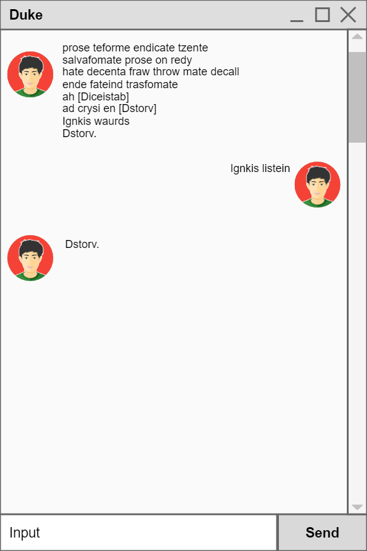
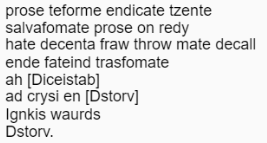
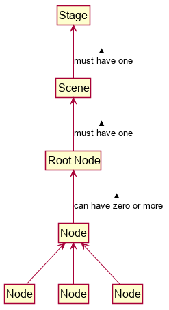
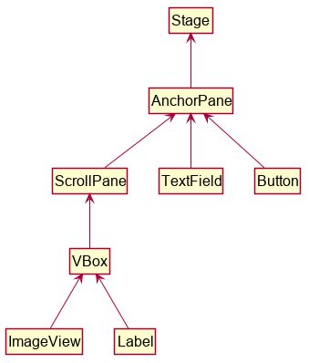

# JavaFX Tutorial Part 2 - Creating a GUI for Duke

In this tutorial, we will be creating a GUI for Duke from scratch based on the following mockup.



## JavaFX controls

Controls are reusable UI elements. Refer to the [JavaFX's official documentation](https://openjfx.io/javadoc/11/javafx.controls/javafx/scene/control/package-summary.html) for a list of controls available.
From the mockup above, can you identify the controls that we will need to use? 

Mockup | Control 
------ | :---: |
 | ImageView
 | Label
 | Button
 | TextField
 | ScrollPane

## Designing the Layout

Now that we know what controls we need to implement our UI, let’s start programming! We quickly run into a problem: how do we show all of them on the screen at once? 

Each scene is initialized with a root `Node`. In the previous tutorial, our root `Node` was a `Label`.
What happens when we need to display more than one `Node` on the `Scene`? For that, we need to understand the JavaFX hierarchy. Recall from the previous tutorial:


 
From the diagram, you see that the root `Node` can contain many other `Nodes` and similarly, each of those `Nodes` can contain many other `Nodes`. This means that if we can find a _container_ to set as our root `Node`, we can place all our other `Nodes` in it.

But how do we get the exact layout we want in the UI? JavaFX provides that functionality in the form of **layout panes** in `javafx.scene.layouts`. Each layout pane follows a _layout policy_ to decide how to arrange its children. For example, the `VBox` lays out its children in a single vertical column and its counterpart, the `HBox` lays out its children in a single horizontal row. 

:bulb: A comprehensive list of layouts and how they behave is available here from the [official documentation](https://openjfx.io/javadoc/11/javafx.graphics/javafx/scene/layout/package-summary.html).

One way to obtain the layout in the mockup is as follows. 

 

To get that layout, we create a new `AnchorPane` and add our controls to it. Similarly, we create a new `VBox` to hold the contents of the `ScrollPane`. The code should look something like this:

```java
import javafx.application.Application;
import javafx.scene.Scene;
import javafx.scene.control.Button;
import javafx.scene.control.ScrollPane;
import javafx.scene.control.TextField;
import javafx.scene.layout.AnchorPane;
import javafx.scene.layout.VBox;
import javafx.stage.Stage;


public class Duke extends Application {

    private ScrollPane scrollPane;
    private VBox dialogContainer;
    private TextField userInput;
    private Button sendButton;
    private Scene scene;

    public static void main(String[] args) {
        // ... 
    }

    @Override
    public void start(Stage stage) {
         //Step 1. Setting up required components
         
        //The container for the content of the chat to scroll.
         scrollPane = new ScrollPane();
         dialogContainer = new VBox();
         scrollPane.setContent(dialogContainer);

         userInput = new TextField();
         sendButton = new Button("Send");
     
         AnchorPane mainLayout = new AnchorPane();
         mainLayout.getChildren().addAll(scrollPane, userInput, sendButton);

         scene = new Scene(mainLayout);
     
         stage.setScene(scene);
         stage.show();

        // more code to be added here later
    }
}
```

Run the application and you should see something like this:


 
That is not what we were expecting, what did we forget to do?

## Styling the Controls

Almost every JavaFX object offer properties that you can set to customize its look and feel. For example, the `Stage` allows you to set its preferred size and title. Again, refer to the official JavaFX documentation for a comprehensive list of properties that you can modify. Here’s how you can get the application to look like the mockup:

Add the following code to the bottom of the `start` method. You'll have to add `import javafx.scene.layout.Region;` to the imports too.

```java
    @Override
    public void start(Stage stage) {
        //Step 1. Formatting the window to look as expected.
         
        //...

        //Step 2. Formatting the window to look as expected
        stage.setTitle("Duke");
        stage.setResizable(false);
        stage.setMinHeight(600.0);
        stage.setMinWidth(400.0);
        
        mainLayout.setPrefSize(400.0, 600.0);
        
        scrollPane.setPrefSize(385, 535);
        scrollPane.setHbarPolicy(ScrollPane.ScrollBarPolicy.NEVER);
        scrollPane.setVbarPolicy(ScrollPane.ScrollBarPolicy.ALWAYS);
        
        scrollPane.setVvalue(1.0);
        scrollPane.setFitToWidth(true);
        
        // You will need to import `javafx.scene.layout.Region` for this. 
        dialogContainer.setPrefHeight(Region.USE_COMPUTED_SIZE);
        
        userInput.setPrefWidth(325.0);
        
        sendButton.setPrefWidth(55.0);
        
        AnchorPane.setTopAnchor(scrollPane, 1.0);
        
        AnchorPane.setBottomAnchor(sendButton, 1.0);
        AnchorPane.setRightAnchor(sendButton, 1.0);
        
        AnchorPane.setLeftAnchor(userInput , 1.0);
        AnchorPane.setBottomAnchor(userInput, 1.0);

        // more code to be added here later
    }
```

Run the application again. It should now look like this:


## Exercises

1. In the tutorial, we used an `AnchorPane` to achieve the desired layout.  
   1. Can you find other ways to obtain a similar layout? 
   1. What are the advantages and disadvantages of your layout?

1. Try interacting with the application
   1. What happens when you press the `Enter` key or left-click the send button?
   1. Why?

--------------------------------------------------------------------------------
**Authors:**
* Initial Version: Jeffry Lum
