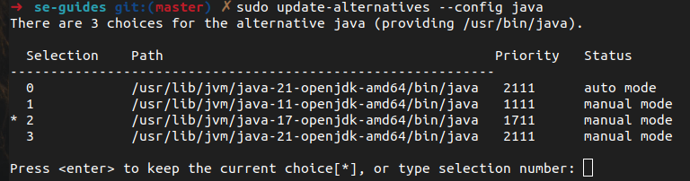
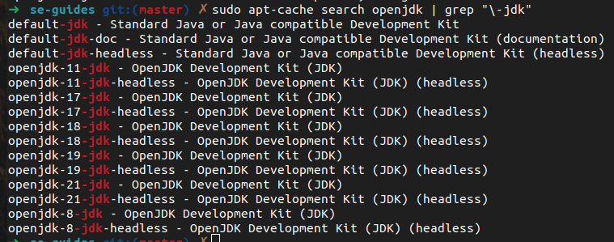


<frontmatter>
  title: "{{ title }}"
  pageNav: 2
</frontmatter>

# {{ title }}

This guide explains how to install the **==[OpenJDK Java 17](https://openjdk-sources.osci.io/openjdk17/)==** on Linux using the command line. This guide was created using Ubuntu 22.04 but the steps for other Debian based Linux distros should be similar.


## Installation
This should be the default option for users with admin access to their system.

* **Update APT repositories** {{ step_numbers }}
   * First we need to ensure our apt repositories are updated. Enter the following command in your terminal: 
     ```bash
     sudo apt update && sudo apt upgrade
     ```
     Enter your password if prompted.
* **Install JDK**
   * Install the Java 17 OpenJDK version by running:
     ```bash
     sudo apt install openjdk-17-jdk 
     ```
     Note that the default installation location is usually `/usr/lib/jvm/`.
* **Verify Installation**
   * To verify the installation, run:
     ```bash
     java -version
     ```

<!-- ======================================================================= -->

## Switching between Java versions

If you have multiple versions of Java installed, you can switch between them using `update-alternatives`.

* **To see the currently active Java version** run,
  ```bash
  java -version
  ```
* **To switch to a different installed version**, run the following command.
  ```bash
  sudo update-alternatives --config java
  ```
  You should see terminal output like this:
  

  Follow the instructions to change to your desired version.
  For example, to use Java 11 in the image above, type `1` into the terminal.
* **If you don't have the desired version installed**, you can search for it by running the following command:
  ```bash
  sudo apt-cache search openjdk | grep "\-jdk"
  ```
  You should see the available OpenJDK Java versions listed like so:
  
  
  Decide on one of the available versions and follow the same steps as above to install your desired Java version.

--------------------------------------------------------------------------------

**Authors:**
* Initial Version: Drustan Yeo ([@drustanyjt](https://github.com/drustanyjt))
