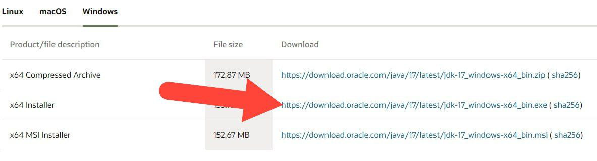


<frontmatter>
title: "{{ title }}"
pageNav: 2
</frontmatter>

# {{ title }}

This guide explains how to install the **==[Oracle Java 17 JDK](https://www.oracle.com/java/technologies/downloads/)== on Windows**.

## Installation

* **Download JDK**.{{ step_numbers }}
    * Go to the Oracle download site [here](https://www.oracle.com/java/technologies/downloads/).{{ abcd_numbers }}
    * Choose **JDK 17** &rarr; **Windows**.
    * Download the **x64 Installer**:

    
* **Install JDK**
    * Run the downloaded installer and complete the installation:{{ abcd_numbers }}
      

* **Verify installation** by running the following command in your terminal (e.g. Command Prompt, PowerShell). You should see the version information for Java 17.0.12.
   ```bash
   java -version
   ```

<!-- ======================================================================= -->

## Switching between Java versions

If you have multiple versions of Java installed, you can switch between them by editing the system environment variables. This involves updating the "Path" settings to point to your desired JDK version.

* **To see the currently active Java version** run,
  ```bash
  java -version
  ```
* **To switch to a different installed version**,
    * Open the Start Menu by clicking the **Start** button on your taskbar or pressing the **Windows** key on your keyboard.
    * Type "environment variables" in the search bar and click "Edit the system environment variables" from the search results.
    * In the window that opens, click on the "Environment Variables" button located near the bottom.
    * Scroll through the "System variables" section to find the "Path" variable, select it and click "Edit"
    * In the "Edit Environment Variable" window, you will see a list of paths. These paths represent directories your system searches to find executables like Java.
      * To prioritize a different Java version: Find the path to your desired Java installation (e.g., C:\Program Files\Java\jdk-17\bin) and move it to the top of the list.
      * To add a new Java version: Click "New" and add the path to the bin folder of the Java version you want to use (e.g., C:\Program Files\Java\jdk-11\bin).
    * Click OK to save your changes and close the windows.
  
* **Verify Version Change** by running the following command in a new terminal window:
   ```bash
   java -version
   ```

--------------------------------------------------------------------------------

**Authors:**
* 
