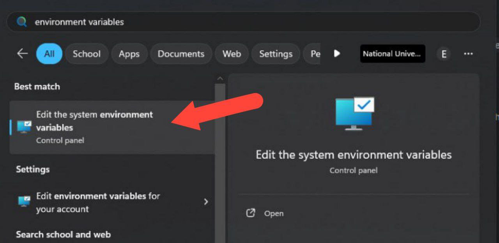
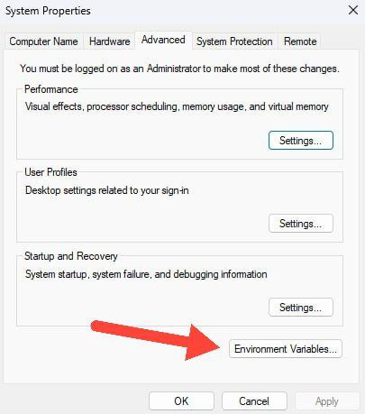
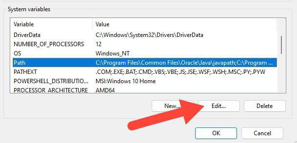
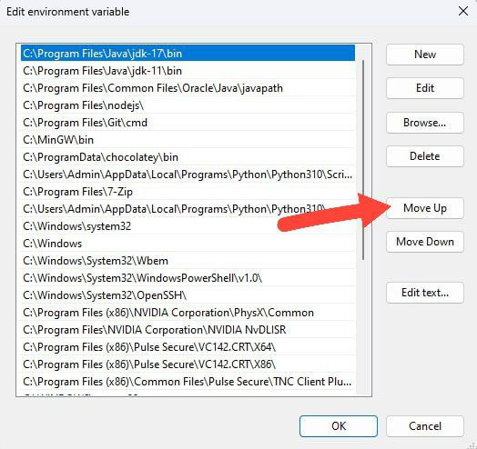
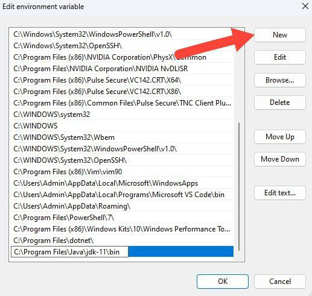


<frontmatter>
title: "{{ title }}"
pageNav: 2
</frontmatter>

# {{ title }}

This guide explains how to install the **==[Oracle Java 17 {{ jdk_popover }}](https://www.oracle.com/java/technologies/downloads/#java17)== on Windows**.

## Installation

* **Download JDK** {{ step_numbers }}
   * Go to the Oracle download site [here](https://www.oracle.com/java/technologies/downloads/#java17).{{ abcd_numbers }}
   * Choose **JDK 17** &rarr; **Windows**.
   * Download the **x64 Installer**:
   <pic src="images/javaInstallationWindows/java_installer_windows.png" width="800">
   
   <box type="info" seamless>

   Go ahead and sign in if you are prompted by Oracle, or register an account if you haven't done so.

   **Alternatively, you may also download the JDK 17 x64 installer from another provider** that does not require you to sign up. Examples:

   * [**Amazon**](https://docs.aws.amazon.com/corretto/latest/corretto-17-ug/downloads-list.html)<br>
   * [**Microsoft**](https://learn.microsoft.com/en-my/java/openjdk/download)<br>
   * [**Temurin**](https://adoptium.net/temurin/releases/?version=17)<br>
   </box>

* **Install JDK**
   * Run the downloaded installer and follow the instructions to complete the installation. {{ abcd_numbers }}
   * Suppose the JDK was installed in the directory `C:\Program Files\Java\jdk-17` (this is the default location for **Oracle**, please check the installation directory within the installer for other distributors).
   <br>
   <br>

* **Verify installation** by running the `java -version` command in your terminal (e.g. Command Prompt, PowerShell).
  <include src="../common/common-fragments.md#windows-restart-terminal" />

<!-- ======================================================================= -->

## Switching between Java versions

**If you have multiple versions of Java installed, you can switch between them by editing the system environment variables.** This involves updating the `Path` settings to point to your desired JDK version.

* **To see the currently active Java version** run the following command in a terminal window,{{ step_numbers }}
  ```bash
  java -version
  ```
* **To switch to a different installed version**,
   1. Open the Start Menu by clicking the `Start` button on your taskbar or pressing the <kbd>:fab-windows:</kbd> key on your keyboard.
   1. Type `environment variables` in the search bar and click `Edit the system environment variables` from the search results:<br>
     
   1. In the window that opens, click on the `Environment Variables` button located near the bottom:<br>
     
   1. Scroll through the "System variables" section to find the `Path` variable, select it and click `Edit`.<br>
     
   1. In the `Edit Environment Variable` window, you will see a list of paths. These paths represent directories your system searches to find executables like Java.
      * To prioritize a different Java version: Find the path to your desired Java installation (e.g., `C:\Program Files\Java\jdk-17\bin`) and move it to the top of the list.<br>
        
      * To add a new Java version: Click "New" and add the path to the bin folder of the Java version you want to use (e.g., `C:\Program Files\Java\jdk-11\bin`).<br>
        
   1. Click OK on both `Edit Environment Variable` and "Environment Variables" windows to save your changes and close the windows.
* **Verify the version change** by running the `java -version` command in a new terminal window:
  <include src="../common/common-fragments.md#windows-restart-terminal" />

* **If you already have a `JAVA_HOME` system variable** defined earlier, you need to update it to point to the JDK of your choice. The procedure is similar to how you changed the `Path` variable.
--------------------------------------------------------------------------------

**Authors:**
* Initial Version: Ryan Chiang ([@macareonie](https://github.com/macareonie)), Yong Jun Xi ([@TobyCyan](https://github.com/TobyCyan))
