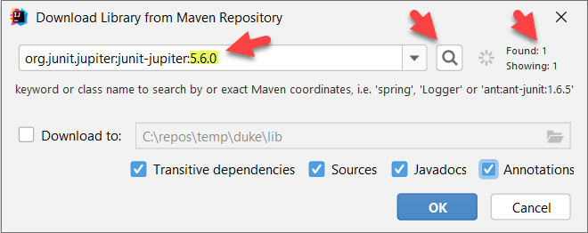
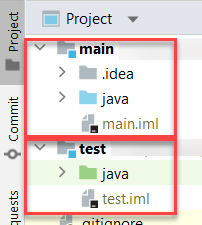
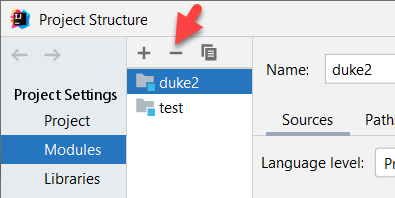

<frontmatter>
  title: "Using JUnit"
  pageNav: 2
</frontmatter>

# Using JUnit

<div class="lead">

[JUnit](https://junit.org/junit5/) is a testing framework for Java.
</div>

Sections below explains how to use JUnit in a project.

<!-- --------------------------------------------------------------------------------------------------------- -->

## Conventions to follow

* Add test code in a folder named `[project root]\src\test\java\` folder.
* Name the test class to match the class being tested (`Todo.java` can be tested by `TodoTest.java`), and put it in a package to match %%(reason: if packages are matched, the test class can access package-private members of the target class)%%. For example,
  * Class being tested `seedu.duke.Todo`: `src\main\java\seedu\duke\Todo.java`
  * Test class `seedu.duke.TodoTest`: `src\test\java\seedu\duke\TodoTest.java`

<!-- --------------------------------------------------------------------------------------------------------- -->

## Adding JUnit support to your project

As JUnit is a third-party library, you need to add support to it specifically in your project. Given below are two ways of doing that. The Gradle option is recommended but it requires the use of an additional tool (i.e., Gradle) which has its own learning curve.

<tabs>
<tab header="With Gradle">

{{ icon_important }} **Prerequisite:** The project is configured to use Gradle already. If you have not done that yet, follow the [_Gradle Tutorial_](gradle.html) to add Gradle support to the project first.

**1. Update the `build.gradle` file** to include JUnit as a dependency. Here are the relevant lines that needs to be in the `build.gradle` (change the version number as necessary):

```groovy {highlight-lines="2, 6-7", heading="buidl.gradle"}
test {
    useJUnitPlatform()
}

dependencies {
    testImplementation group: 'org.junit.jupiter', name: 'junit-jupiter-api', version: '5.5.0'
    testRuntimeOnly group: 'org.junit.jupiter', name: 'junit-jupiter-engine', version: '5.5.0'
}
```

**2. Add a test class**, while following the conventions given earlier in this page. If you don't follow those conventions, Gradle will not be able to find your test class. For example, if you have a class `src\main\java\seedu\duke\Todo.java`, you can add a test class `src\`==test==`\java\seedu\duke\`==TodoTest.java==. Here's some sample code:

```java
package seedu.duke;

import org.junit.jupiter.api.Test;

import static org.junit.jupiter.api.Assertions.assertEquals;

public class DukeTest {
    @Test
    public void dummyTest(){
        assertEquals(2, 2);
    }

    @Test
    public void anotherDummyTest(){
        assertEquals(4, 4);
    }
}
```
Later, you can add more tests and test classes as necessary.

**3. Run tests**, either using the Intellij UI (preferred -- this makes debugging failed test cases easier) or using Gradle itself, as explained in the section below.

</tab>
<tab header="In Intellij, without Gradle">

1. Add a folder named `[project root]\src\test\java\`
1. Go to Intellij and add a new module to the project as follows.
   1. `File` → `New` → `Module From Existing Sources ...`
   1. Choose the `[project root]\src\test\` (not the `java`) folder.
   1. In the next screen, select `Create module from existing sources`
   1. Keep clicking `Next` until the process is complete
1. In the `Project` panel of Intellij, expand the newly-created `test` module, right-click on the `java` folder inside it, and choose `Mark Directory as` → `Test Source Root` (that will make the folder turn to green color).
1. Now, create a class inside the `java` folder and type `@Test` inside it. A code example given below.<br>
   {{ icon_info }} Note: If you are using packages, create this class in a matching package (to test `duke.Duke` class, create a `duke.DukeTest` i.e., in `src\test\java\duke\DukeTest.java`).
   ```java
   public class DukeTest {
       @Test
   }
   ```
1. Note how the `@Test` turn to red because Intellij (not having JUnit support yet) does not understand it. But it will pop up a hint, asking if you want to add support for JUnit. Select `Add JUnit 5.* to classpath`.
1. In the dialog that pops up, you can optionally tick the `Sources`, `JavaDocs` and `Annotations` boxes. After that, click `OK` to add the JUnit 5 to the project dependencies.<br>
   <box type="info" seamless>

   When using the dialog shown below, if the version auto-selected by Intellij is not available (i.e., it shows `Found: 0`), change the version number to a slightly lower number (e.g., `5.6.0`) and click the :fas-search: button to try again.<br>
   
   </box>
1. To check if JUnit integration is working as expected,<br>
   7a\. Add a dummy test method to the class e.g.,
      ```java
      import org.junit.jupiter.api.Test;
      
      import static org.junit.jupiter.api.Assertions.assertEquals;
      
      public class DukeTest {
          @Test
          public void dummyTest(){
              assertEquals(2, 2);
          }
      }
      ```
   7b\. Run the test (right-click on the class and choose `Run DukeTest`).
1. To be able to refer to `Duke` from `DukeTest` class, you need to add `main` module as a dependency of the `test` module you just created.<br>
   8a\. First, ensure there is a `main` module in your project, as follows:
      1. Check if your project explorer look like this (note how the `main` and `test` modules show up).<br>
      <br>
   <box type="tip" seamless>

   To see other project sub-folders (e.g., `docs`) not currently shown (refer to the screenshot above), you can change the dropdown (shown at the top of the screenshot) from `Project` to `Project files`
   </box>

      1. If there is no module named `main`, Intellij may have failed to recognize the `main` folder as the source folder and auto-created a module to include the entire project folder, usually given the same name as project folder. If there is such an extraneous module, delete that first (Go to `File` -> `Project Structure`,  click on `Modules`, select the module you want to delete, and click on the `-` button), followed by `OK`/`Apply`.<br>
        
      1. After that, create the `main` module the same way you created the `test` module in an earlier step above.<br>
         Tip: You may have to close the project and open it again after creating the `main` module, before you can see the `main` module in the project explorer view.

   8b\. Now that you have the modules `main` and `test`, you can set up the dependency using one of these options:
      * Option 1: When you add a reference to the `Duke` inside the `DukeTest`, Intellij will flag it as an error and will give you an option (i.e., in the bulb icon that pops up) to add the `main` module as a dependency.<br>
      * Option 2: Follow the info [here](https://www.jetbrains.com/help/idea/working-with-module-dependencies.html) to add the dependency yourself.

<box type="info" seamless>

As you can see from the above, setting up JUnit in Intellij is somewhat complicated. The good news is that it is easier to add JUnit to a project if you are using a build tool such as Gradle (although Gradle itself has a learning curve).
</box>
</tab>
</tabs>

<br>

<!-- --------------------------------------------------------------------------------------------------------- -->

## Running tests



* In Intellij IDEA:
  * To run a specific JUnit test class (e.g., `src/test/java/seedu/DukeTest.java`), right-click on the test class, and choose {{ play_button }} `Run {classname}`.
  * To run all tests in a folder (e.g., `src/test/java` folder), right-click on the folder, and choose {{ play_button }} `Run Tests in '...'`.
 * Using Gradle:
   * Run the `test` task (runs all tests in the project)

<!-- --------------------------------------------------------------------------------------------------------- -->

## Resources

* [JUnit 5 User Guide](https://junit.org/junit5/docs/current/user-guide/)
