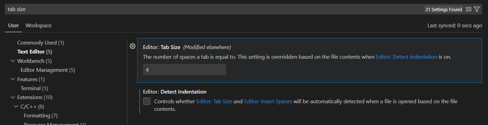
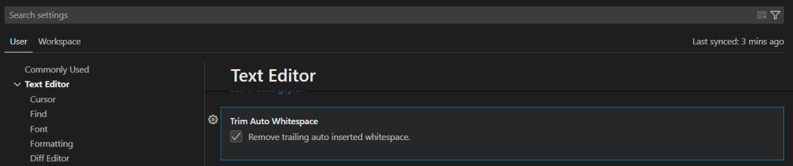
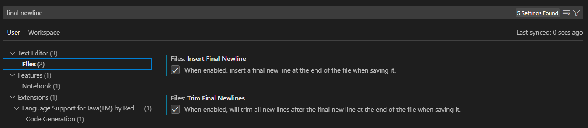
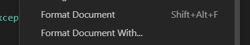
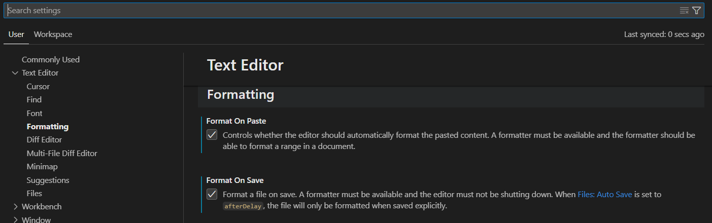


<frontmatter>
  title: "{{ title }}"
  pageNav: 2
</frontmatter>

<include src="vscode.md#wip-warning" />

# {{ title }}

Visual Studio Code provides some basic editor configurations for some general use cases. These settings will be applied as long as they are not overridden by an extension’s formatter.

## Modifying Visual Studio Code Settings

Visual Studio Code settings are accessible through the top menu navigation bar.    
Windows: `File` → `Preferences` → `Settings`, or `Ctrl+,` (shortcut)    
macOS: `Code` → `Preferences` → `Settings`, or `Cmd+,` (shortcut)    

Settings are stored in a `settings.json` file. Changes in `settings.json` will be reflected in the `Settings` tab UI and vice versa.       
Workspace Settings: `.vscode/settings.json`    
User Settings: `%APPDATA%\Code\User\settings.json` (Windows), `~/Library/Application Support/Code/User/settings.json` (macOS)    

<box type="tip" seamless>

**User Settings VS Workspace Settings**
Visual Studio Code allows you to configure User and Workspace Settings. User Settings apply to all projects & files and are suitable for your personal preferences and global defaults. Workspace settings apply only to the current project by overriding user settings and are suitable for project-specific rules that may differ from global.
</box>

Some settings are also configurable through the command palette (`Cmd+Shift+P` for macOS and `Ctrl+Shift+P` for Windows).

## Tweak: Indent size/Tab spaces

To format indent size based on coding standards through Settings:
1. Open Settings by going to `File` → `Preferences` → `Settings` (Windows), or `Code` → `Preferences` → `Settings` (macOS).
1. Search for `Editor: Tab Size` and set it to 4 as specified by coding standards (see the screenshot below).
1. (Optional) Disable `Editor: Detect Indentation` to always use this indentation regardless of the indentation an existing file is using.

    

This can also be done through modifying `.vscode/settings.json`
1. Add the following properties to your `settings.json`
    ```
    {
        // ...
        "editor.tabSize": 4,
        "editor.insertSpaces": true,
        "editor.detectIndentation": false
        // ...
    }
    ```

## Tweak: Auto-remove trailing whitespaces

To remove trailing whitespaces automatically through Settings:
1. Open Settings by going to `File` → `Preferences` → `Settings` (Windows), or `Code` → `Preferences` → `Settings` (macOS).
1. Search for `Trim Auto Whitespace`, which is under `Text Editor` (see the screenshot below).
1. Enable the setting by checking the box.

    


This can also be done through modifying `.vscode/settings.json`:
1. Add the following property to your settings.json
    ```
    {
        // ...
        "editor.trimAutoWhitespace": true
        // ...
    }
    ```

## Tweak: Add newline (\n) to end of file

To ensure there is a newline at the end of each file through Settings:

1. Open Settings by going to `File` → `Preferences` → `Settings` (Windows), or `Code` → `Preferences` → `Settings` (macOS).
1. Search for `Files: Insert Final Newline` under `Text Editor` → `Files` and check the box to ensure there is a newline at the end of the file (see the screenshot below).
1. Search for `Files: Trim Final Newlines` under `Text Editor` → `Files` and check the box to ensure there is no more than one newline at the end of the file (see the screenshot below).

    

This can also be done through modifying `.vscode/settings.json`:
1. Add the following properties to your `settings.json`:
    ```
    {
        // ...
        "files.insertFinalNewline": true,
        "files.trimFinalNewlines": true
        // ...
    }
    ```

## Applying format

To apply the format settings made in the above sections to a file, right click within the file and click `Format Document`.



To make formatting more convenient, you can enable formatting every time you save the file, and also automatically format pasted code.

1. Open Settings by going to `File` → `Preferences` → `Settings` (Windows), or `Code` → `Preferences` → `Settings` (macOS)
1. Go to `Text Editor` → `Formatting` and enable `Format On Paste` and/or `Format On Save` to automatically format code that is pasted, and to format the document everytime you save respectively (see screenshot below).

    


## More advanced settings

The tweaks given above are limited to functionality provided by VSCode’s Editor. More configurations can be done through the extension’s formatter, and can be found [here](vscCodeStyleAdvanced.md).

## More useful settings

The tweaks given above are specific to code style. A few more useful settings (not related to the code style) can be found [here](vscUsefulSettings.md).
