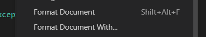


<frontmatter>
  title: "{{ title }}"
  pageNav: 2
</frontmatter>

<include src="../common/common-fragments.md#wip-warning" />

# {{ title }}

While the Visual Studio Code Editor has configurable general settings for indent size, trailing whitespaces, and more, Visual Studio Code does not come with a built-in formatter for all languages. Instead, it relies on language-specific extensions to provide formatting functionality.

For this tutorial, we will be using the Eclipse Java Formatter. This is included in the Red Hat Java Language Support extension, which you should already have installed if you followed [VS Code - Preparing for Java Projects Tutorial](vscPreparingForJava.md) tutorial.

## Set up Eclipse Java Formatter

Eclipse Java Formatter requires a `.xml` file to define our formatting rules. Copy the following `eclipse-java-formatter.xml` template and place it at the root of your project.

```
<?xml version="1.0" encoding="UTF-8"?>
<profiles version="12">
    <profile kind="CodeFormatterProfile" name="SE-EDU" version="12">
        <!-- Replace this comment with actual formatter rules -->
    </profile>
</profiles>
```

Configure settings to use our `eclipse-java-formatter.xml` through Settings:
1. Open Settings by going to `File` → `Preferences` → `Settings` (Windows), or `Code` → `Preferences` → `Settings` (macOS).
1. Go to `Extensions` → `Language Support for Java(TM) by Red Hat` → `Formatting` tab.
1. Check the checkbox for `Java > Format: Enabled` to allow the formatter to be selected as default (see screenshot below).
1. Enter the path to your `eclipse-java-formatter.xml` under `Java` → `Format` → `Settings: Url`. Since we placed it at the root, this value would be `eclipse-java-formatter.xml` (see screenshot below).
1. Enter the profile name, which we have set to `SE-EDU` in our `eclipse-java-formatter.xml` (see screenshot below).

    

This can also be done through modifying `.vscode/settings.json`:
1. Add the following properties to settings.json:
    ```
    "java.format.settings.url": "eclipse-java-formatter.xml",
    "java.format.settings.profile": "SE-EDU"
    ```

If you have installed any other Java extensions, VS Code may use that extension's formatter instead. To ensure our formatting is being applied, we will set Red Hat Java Language Support extension’s formatter as the default.

Configure this through Settings:
1. Search for `Default Formatter` with the filter `@lang:java`.
1. Ensure that `Language Support for Java(TM) by Red Hat` is selected as default (see screenshot below).

    

This can also be done through modifying `.vscode/settings.json`:
1. Add the following properties to settings.json:    

    ```
    "[java]": {
        "editor.defaultFormatter": "redhat.java"
    }
    ```

## Tweak: Switch-case indent

To format switch-case statements based on coding standards, add the following settings to `eclipse-java-formatter.xml` within the profile tag.
```
<!-- ... -->
<profile kind="CodeFormatterProfile" name="SE-EDU" version="12">
    <!-- ... -->
    <setting id="org.eclipse.jdt.core.formatter.indent_switchstatements_compare_to_switch" value="false"/>
    <setting id="org.eclipse.jdt.core.formatter.indent_switchstatements_compare_to_cases" value="true"/>
    <!-- ... -->
</profile>
<!-- ... -->
```

## Tweak: Line limit

To enforce line length to be max 120 characters based on coding standards, add the following settings to `eclipse-java-formatter.xml`.
```
<!-- ... -->
<profile kind="CodeFormatterProfile" name="SE-EDU" version="12">
    <!-- ... -->
    <setting id="org.eclipse.jdt.core.formatter.lineSplit" value="120"/>
    <!-- ... -->
</profile>
<!-- ... -->
```

## Tweak: Indent size/Tab spaces

To format indent size based on coding standards, add the following settings to `eclipse-java-formatter.xml`.
```
<!-- ... -->
<profile kind="CodeFormatterProfile" name="SE-EDU" version="12">
    <!-- ... -->
    <!-- Use spaces, not tabs -->
    <setting id="org.eclipse.jdt.core.formatter.tabulation.char" value="space"/>
    <!-- Tab size = 4 spaces -->
    <setting id="org.eclipse.jdt.core.formatter.tabulation.size" value="4"/>
    <!-- One indent level = 4 spaces -->
    <setting id="org.eclipse.jdt.core.formatter.indentation.size" value="4"/>
    <!-- Wrapped lines indent = 8 spaces -->
    <setting id="org.eclipse.jdt.core.formatter.continuation_indentation" value="8"/>
    <!-- ... -->
</profile>
<!-- ... -->
```

## Tweak: Add newline (\n) to end of file

To ensure there is a newline at the end of each file, add the following settings to `eclipse-java-formatter.xml`.
```
<!-- ... -->
<profile kind="CodeFormatterProfile" name="SE-EDU" version="12">
    <!-- ... -->
    <setting id="org.eclipse.jdt.core.formatter.insert_new_line_at_end_of_file_if_missing" value="true"/>
    <!-- ... -->
</profile>
<!-- ... -->
```

## Tweak: Import Order

To format the import order based on coding standards:

1. Add the following settings to `eclipse-java-formatter.xml`.
    ```
    <profile kind="CodeFormatterProfile" name="SE-EDU" version="12">
        <!-- ... -->
        <setting id="org.eclipse.jdt.core.formatter.importOrder" value="java,javax,org,com"/>
        <setting id="org.eclipse.jdt.core.formatter.importOrderStatic" value="java,javax,org,com"/>
        <setting id="org.eclipse.jdt.core.formatter.sort_static_imports_separately" value="true"/>
        <setting id="org.eclipse.jdt.core.formatter.imports_static_on_top" value="true"/>
        <setting id="org.eclipse.jdt.core.formatter.insert_new_line_between_import_groups" value="true"/>
        <!-- ... -->
    </profile>
    ```
1. Add the following properties to `.vscode/settings.json`
    ```
    {
        // ...
        "java.saveActions.organizeImports": true,
        "editor.codeActionsOnSave": {
            "source.organizeImports": "explicit",
        }
        // ...
    }
    ```
## Applying format

To apply the format settings made in the above sections to a file, right click within the file and click `Format Document`.



To make formatting more convenient, you can enable formatting every time you save the file, and also automatically format pasted code.

1. Open Settings by going to `File` → `Preferences` → `Settings` (Windows), or `Code` → `Preferences` → `Settings` (macOS)
1. Go to `Text Editor` → `Formatting` and enable `Format On Paste` and/or `Format On Save` to automatically format code that is pasted, and to format the document everytime you save respectively (see screenshot below).

    


## More useful settings

The tweaks given above are specific to code style. A few more useful settings (not related to the code style) can be found [here](vscUsefulSettings.md).

---

**Contributors**: Tan Guan Qun ([@monobeartae](https://github.com/monobeartae))
