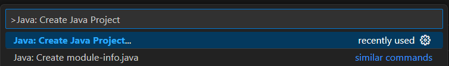


<frontmatter>
  title: "{{ title }}"
  pageNav: 2
</frontmatter>

<include src="vscode.md#wip-warning" />

# {{ title }}

This guide will walk you through creating a new Java project in VS Code from scratch.

## Prerequisites

* VS Code with the Extension Pack for Java installed
* Java Development Kit (JDK) installed

<box type="tip" seamless>

**Need help with setup?** Check out our [Preparing VS Code for Java](vscodeJavaSetup.html) guide first.
</box>

## Method 1: Use VS Code's project wizard

The easiest way to create a new Java project is using VS Code's built-in project wizard.

1. **Open the Command Palette**: {{ icon_windows }}/{{ icon_linux}} `Ctrl+Shift+P` | {{ icon_apple }} `Cmd+Shift+P`
2. **Type** `Java: Create Java Project` and select it

3. **Select** the desired build tool:
   * **No build tool** - For simple projects
   * **Gradle** - For projects that will use Gradle build system
   * **Maven** - For projects that will use Maven build system
4. **Choose the location** and **enter the project name** as prompted
5. **VS Code will create** the basic project structure for you

## Method 2: Create project manually

If you prefer more control over the project setup, you can create a project manually.

### Step 1: Create a workspace folder

1. **Create a project folder** on your computer (e.g., `MyJavaProject`)
2. **Open VS Code** and select `File` → `Open Folder...`
3. **Navigate to and select** your project folder
4. **Click "Select Folder"** to open it as a workspace

### Step 2: Set up the project structure

Let's start with a simple structure:

```text
MyJavaProject/
└── src/
    └── (your Java source files will go here)
```

**To create the source folder:**

1. **Open the Explorer panel**: {{ icon_windows }}/{{ icon_linux}} `Ctrl+Shift+E` | {{ icon_apple }} `Cmd+Shift+E` 
2. **Right-click in the Explorer panel**
3. **Select** `New Folder`
4. **Name it** `src`

<box type="info" seamless>

VS Code automatically handles compilation, so you do not need separate folders for compiled `.class` files.
</box>

### Step 3: Create your first Java class

1. **Right-click** on the `src` folder
2. **Select** `New File`
3. **Name it** `HelloWorld.java`
4. **Add the following code:**

```java
public class HelloWorld {
    public static void main(String[] args) {
        System.out.println("Hello, World!");
    }
}
```

5. **Save the file**: {{ icon_windows }}/{{ icon_linux}} `Ctrl+S` | {{ icon_apple }} `Cmd+S`

VS Code will automatically compile the Java file when you save it.

## Configure your JDK

<box type="tip" seamless>

If you already have Java installed, VS Code should automatically detect and configure it when you create your project.
</box>

After creating your project, you may need to verify and configure VS Code to use the correct JDK version.

1. **Open the Command Palette**: {{ icon_windows }}/{{ icon_linux}} `Ctrl+Shift+P` | {{ icon_apple }} `Cmd+Shift+P`
2. **Type** `Java: Configure Java Runtime` and select it
3. **Verify your JDK** appears in the dropdown list and is selected
4. **Select the appropriate JDK** if you have multiple versions installed


## Configure project settings

### Manual Configuration

To view and modify project settings:

1. **Open the Command Palette**: {{ icon_windows }}/{{ icon_linux}} `Ctrl+Shift+P` | {{ icon_apple }} `Cmd+Shift+P`
2. **Type** `Java: Open Project Settings` and select it
3. **Configure** as needed:
   * **Source paths** - Directories where your Java source files are located
   * **Output path** - Directory where compiled `.class` files will be stored
   * **Libraries** - External JAR files or libraries your project depends on
   * **JDK version** - The JDK version to use for compilation and runtime


### Using `.vscode/settings.json`

You can also configure project settings by creating a `.vscode/settings.json` file in the root directory:

```json
{
    "java.project.sourcePaths": [
        "src"
    ],
    "java.project.outputPath": "bin",
    "java.project.referencedLibraries": [
        "lib/**/*.jar"
    ]
}
```

## Running your project

1. **Open your Java file** with a `main` method
2. **Click the "Run" button** that appears above the `main` method or at the top right corner of the editor, or
3. **Press** `F5` to run in debug mode
4. **Check the terminal output** to see your program's output

## Best practices

### Version control

Add the following to your `.gitignore` file:

```gitignore
# Compiled class files
*.class

# VS Code workspace settings
.vscode/
```

## Next steps

Once you have your project created, you might want to:

* [Configure code formatting](vscSettingUpCheckstyle.html)
