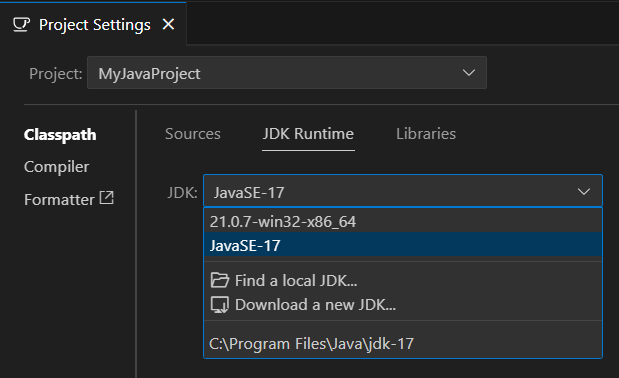
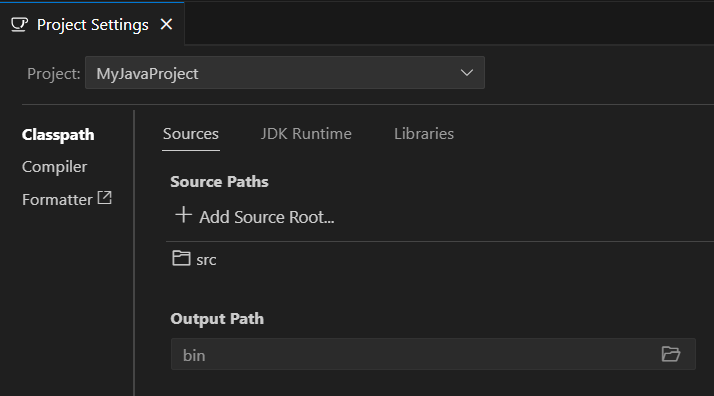


<frontmatter>
  title: "{{ title }}"
  pageNav: 2
</frontmatter>

<include src="vscode.md#wip-warning" />

# {{ title }}

This guide will help you import and work with existing Java projects in VS Code.

## Prerequisites

* VS Code with the Extension Pack for Java installed
* Java Development Kit (JDK) installed

<box type="tip" seamless>

**Need help with setup?** Check out our [Preparing VS Code for Java](vscodeJavaSetup.html) guide first.
</box>

## Importing an existing Java project

### Step 1: Open the project folder

1. **Open VS Code**
2. **Select** `File` → `Open Folder...`
3. **Navigate to your existing Java project** folder
4. **Click "Select Folder"** to open it as a workspace

### Step 2: Let VS Code detect the project

1. **VS Code will automatically detect** the Java files and set up the workspace
2. **Wait for the Java Language Server** to initialize (progress shown in status bar)
3. **Check the status bar** at the bottom for any initialization messages

### Step 3: Verify project configuration

After the project loads:

1. **Check syntax highlighting** - Java files should have proper syntax highlighting
2. **Test IntelliSense** - Try typing in a Java file to see if code completion works
3. **Look for error indicators** - VS Code will underline syntax errors in red

## Configure your JDK

<box type="tip" seamless>

If you already have Java installed, VS Code should automatically detect and configure it when you create your project.
</box>

After creating your project, you may need to verify and configure VS Code to use the correct JDK version.

1. **Open the Command Palette**: {{ icon_windows }}/{{ icon_linux}} `Ctrl+Shift+P` | {{ icon_apple }} `Cmd+Shift+P`
2. **Type** `Java: Configure Java Runtime` and select it
3. **Verify your JDK** appears in the dropdown list and is selected
4. **Select the appropriate JDK** if you have multiple versions installed



## Configure project settings

### Manual Configuration

To view and modify project settings:

1. **Open the Command Palette**: {{ icon_windows }}/{{ icon_linux}} `Ctrl+Shift+P` | {{ icon_apple }} `Cmd+Shift+P`
2. **Type** `Java: Open Project Settings` and select it
3. **Configure** as needed:
   * **Source paths** - Directories where your Java source files are located
   * **Output path** - Directory where compiled `.class` files will be stored
   * **Libraries** - External JAR files or libraries your project depends on
   * **JDK version** - The JDK version to use for compilation and runtime



### Using `.vscode/settings.json`

You can also configure project settings by creating a `.vscode/settings.json` file in the root directory:

```json
{
    "java.project.sourcePaths": [
        "src"
    ],
    "java.project.outputPath": "bin",
    "java.project.referencedLibraries": [
        "lib/**/*.jar"
    ]
}
```

## Running imported projects

1. **Locate the main class** with a `main` method
2. **Click the "Run" button** that appears above the `main` method or at the top right corner of the editor, or
3. **Press** `F5` to run in debug mode
4. **Check the terminal output** to see your program's output

## Best practices

### Version control

Add the following to your `.gitignore` if not already present:

```gitignore
# Compiled class files
*.class

# VS Code workspace settings
.vscode/
```

## Next steps

Once you have successfully imported your project, you might want to:

* [Configure code formatting](vscSettingUpCheckstyle.html) to match team standards
