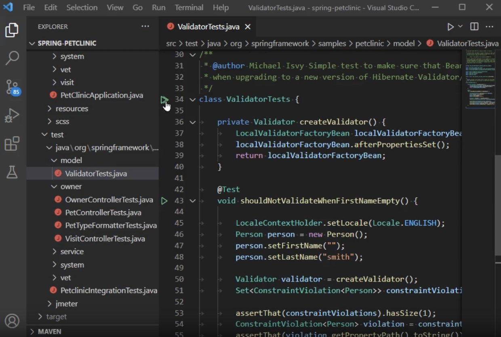
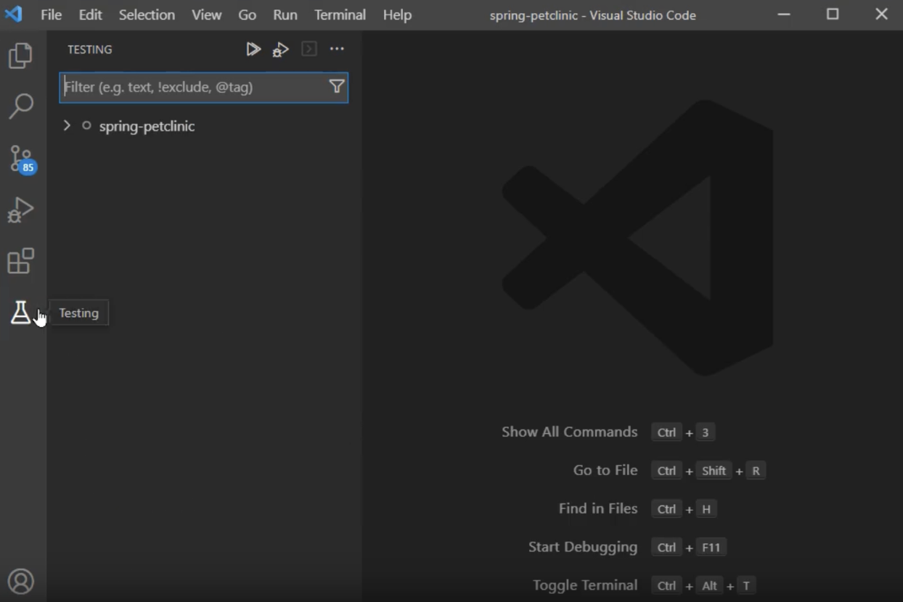


<frontmatter>
  title: "{{ title }}"
  pageNav: 2
</frontmatter>

<include src="../common/common-fragments.md#wip-warning" />

# {{ title }}

This tutorial covers the basics of using VS Code’s JUnit.

<!-- ======================================================== -->

## Prerequisites

<include src="vscCreatingNewJavaProject.md#vsc-java-prereq" />

<include src="junit.md#junit-use-gradle" />

This tutorial assumes you are using Gradle to manage JUnit.

<!-- ======================================================== -->

<include src="junit.md#add-junit-to-gradle" />

<box type="tip" seamless>

Restart VSCode after updating the `build.gradle` file, to ensure the changes take effect.
</box>

<!-- ======================================================== -->

<include src="junit.md#junit-conventions" />

<!-- ======================================================== -->

<include src="junit.md#first-unit-test" />

<box type="tip" seamless>

**VS Code Java extension helps generate test method skeletons.** Right-click in your Java file and click on `Source Action...`, then choose `Generate Tests...`.

* If triggered from a main class file, VS Code prompts you to choose methods to test. It generates skeleton test methods which you can fill in.
* If triggered from a test file, it offers options to choose the types of test methods to add, including lifecycle methods and standard test methods.
</box>

<!-- ======================================================== -->

## Running Tests

****Using VS Code:****

* Use the **green play button** next to the class or method to run tests.
  
* The Testing Explorer is a tree view to show all the test cases in your workspace.
   Open the Testing Explorer by clicking the beaker icon in the left Activity Bar. You can run/debug tests and view their results from there as well.
   

<!-- ======================================================== -->

## Checking Test Coverage

* **Right-click** on the test and choose `Run with Coverage`.
* After the test runs, **covered code** is highlighted in **light blue** in the source files.

<!-- ======================================================== -->

<include src="junit.md#useful-test-cases" />

<!-- ======================================================== -->

<include src="junit.md#troubleshooting-junit" />

<!-- ======================================================== -->

---

**Contributors**: Song Yuexi ([@YosieSYX](https://github.com/YosieSYX))
