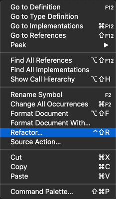
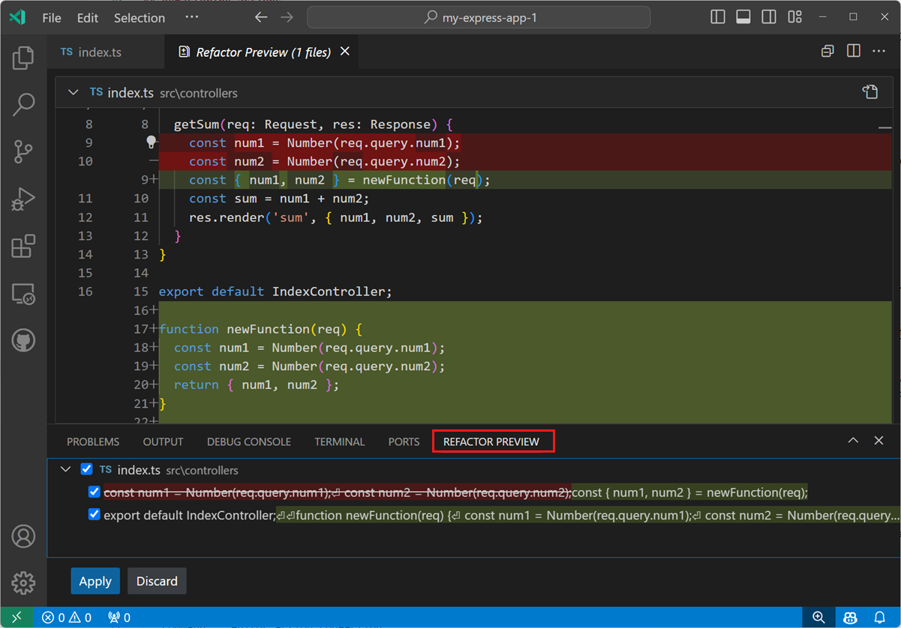


<frontmatter>
  title: "{{ title }}"
  pageNav: 2
</frontmatter>

<include src="../common/common-fragments.md#wip-warning" />

# {{ title }}

Source code refactoring helps improve the quality and maintainability of your project by restructuring your code without altering its runtime behavior. Visual Studio Code offers a variety of refactoring tools to help you clean up and optimize your code directly within the editor.

<!-- ======================================================== -->

## Invoking Refactoring

Refactoring commands are accessible from the editor’s context menu.  
Simply select the element you want to refactor, right-click to open the menu, and choose `Refactor...`.

<!-- ======================================================== -->

## Refactoring Actions

### Extract Method

This action creates a new method from the selected statements or expressions and replaces the original code with a call to the new method.  
It’s especially useful for simplifying large, complex methods by breaking them down into smaller, more manageable pieces.

* Select the code you want to extract.
* Click the **light bulb** icon in the gutter to view available refactorings.

<video autoplay muted loop playsinline width="640" height="360" controls>
  <source src="https://code.visualstudio.com/assets/docs/java/java-refactoring/refactor.mp4" type="video/mp4">
  Your browser does not support the video tag.
</video>

---

### Rename

Renaming allows you to change the name of a class, method, variable, or other symbol, automatically updating all references to it across your workspace, including other files.

* Select the symbol you want to rename.
* Right-click and choose `Rename Symbol` or simply press `F2`.
* Type the new name in the inline input box that appears.

For more refactoring actions, refer to [here](https://code.visualstudio.com/docs/java/java-refactoring#_refactoring).

<!-- ======================================================== -->

## Refactor Preview

When you perform a refactoring, changes are applied directly to your code.  
The **Refactor Preview** panel lets you review these changes before finalizing them.

To open the Refactor Preview:

1. Open the **Code Actions** menu.
2. Hover over the desired refactoring and press `⌘Enter`.
3. Review the changes in the panel.
4. Use **Accept** or **Discard** to apply or cancel the changes.
5. Optionally, selectively apply changes by deselecting individual items.

<!-- ======================================================== -->

## Source Actions

Source Actions let you generate common code structures and quickly fix issues detected in your code. They include both refactorings and Quick Fixes.

* Right-click and select `Source Action…`.
* Choose from the list of available commands.

### Organize Imports

This action automatically cleans up and optimizes your import statements.  
If multiple imports are ambiguous, a dropdown list helps you select the correct one, showing the relevant code line for context.

<video autoplay muted loop playsinline width="640" height="360" controls>
  <source src="https://code.visualstudio.com/assets/docs/java/java-refactoring/resolve-ambiguous-imports.mp4" type="video/mp4">
  Your browser does not support the video tag.
</video>

---

### Generate `toString()` Method

This action automatically generates a `toString()` method with customizable options to include specific member variables.

<video autoplay muted loop playsinline width="640" height="360" controls>
  <source src="https://code.visualstudio.com/assets/docs/java/java-refactoring/generate-tostring.mp4" type="video/mp4">
  Your browser does not support the video tag.
</video>

For more refactoring actions, refer to [here](https://code.visualstudio.com/docs/java/java-refactoring#_source-actions).

---

<box type="tip" seamless>

In VS Code, **Code Actions** provide both refactorings and Quick Fixes for issues indicated by red squiggles.

When your cursor is on a squiggly underline or a selected code region, a **light bulb icon** appears in the editor.  
Click this icon or use the Quick Fix shortcut (`⌘.`) to access the available Code Actions.

</box>

<!-- ======================================================== -->

---

**Contributors**: Song Yuexi ([@YosieSYX](https://github.com/YosieSYX))
