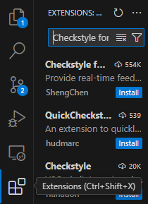


<frontmatter>
  title: "{{ title }}"
  pageNav: 2
</frontmatter>


<include src="vscode.md#wip-warning" />

# {{ title }}

Given below are the steps to set up a Checkstyle plugin in VS Code so that VS Code can alert you about code style problems as you write code.

* **Verify prerequisites:** {{ step_numbers }}
  * Ensure you followed the section [Preparing VS Code for Java projects](#preparing-vs-code-for-java-projects) above.
  * The two Checkstyle config files (`checkstyle.xml` and `suppressions.xml`) should be in the `./config/checkstyle` directory, as mentioned [here](checkstyle.md). {{ abcd_numbers }}
* Open VS Code.
* Download the [Checkstyle for Java](https://marketplace.visualstudio.com/items?itemName=shengchen.vscode-checkstyle) extension by author ShengChen using `Extensions` -> Search `Checkstyle for Java` -> Install (the first entry).<br>
   
* Open the project directory in VS Code using `File -> Open Folder...`.
* Set up the extension to use the project's Checkstyle files as follows:
  * Check if the `./.vscode/settings.json` file exists. If not, create a folder `.vscode` in the project root directory and add a file `settings.json` within the `.vscode` folder. This file contains configuration settings for projects in VS Code. {{ abcd_numbers }}
   * Add these configuration settings to the `settings.json` file. These settings ensure that the Checkstyle extension uses the correct configuration files in the `./config/checkstyle` directory:
     ```json { heading="settings.json" }
      {
        "java.checkstyle.configuration": "${workspaceFolder}/config/checkstyle/checkstyle.xml",
        "java.checkstyle.properties": {
          "config_loc": "${workspaceFolder}/config/checkstyle"
        }
      }
      ```
* Add `.vscode` to your `.gitignore` if you haven't done so by adding these few lines to the end of `.gitignore`:
  ```sh { heading=".gitignore" }
  # VS Code
  /.vscode/
  ```
* Now you should be able to edit your code with Checkstyle violations being detected as you edit them in the `Problems` tab in VS Code. For example, after changing the code to add a wildcard import, you can see that the wildcard import on line 11 has been detected by the Checkstyle extension:<br>
  <pic src="images/vscode/checkstyle-vscode-example.png" width="600" />

---

**Contributors**: Brendon Koh ([@brein62](https://github.com/brein62))