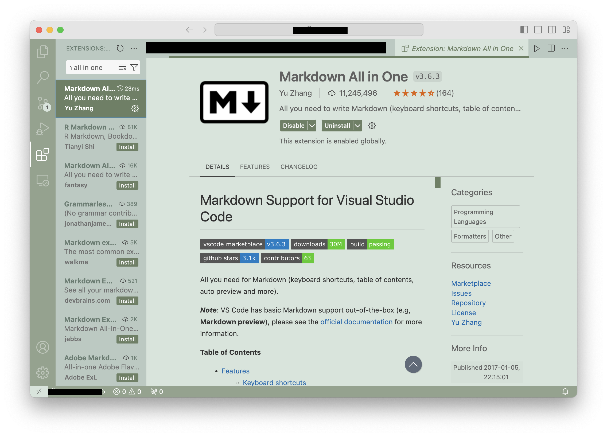


<frontmatter>
  title: "{{ title }}"
  pageNav: 2
</frontmatter>

<include src="vscode.md#wip-warning" />

# {{ title }}

This tutorial introduces some useful plugins relevant to CS2103T. 

## Markdown All in One

**Markdown All in One** can be used to preview `.md` files in **real-time** in VS Code. This is useful for editing README files, documentation, and tutorial content. 

<box type="tip" seamless>
    You can preview files while maintaining formatting and structure of diagrams, charts, and more. 
    </box>

### Installing the plugin

1. Open the **Extensions sidebar** in VS Code 
2. Search for **‘Markdown All in One’ by Yu Zhang**
3. Click `Install`

You should now see a new preview option when working with Markdown files.

### Previewing Markdown

To preview the Markdown side-by-side with your `.md` file:

1. Open a `.md` file (e.g. README.md)
2. Select the **Preview icon** beside the Run icon in the editor bar (`cmd/ctrl + k v`) 
   * To preview in a new tab: `cmd/ctrl + shift + v`

This shows the rendered Markdown in a split view beside your code.

You can find some useful `Markdown` writing basics in this VS Code [documentation](https://code.visualstudio.com/Docs/languages/markdown).

### Additional Features

* Useful shortcuts including autocomplete, keyboard shortcuts, pasting links
* Supports LaTeX equations, diagrams, footnotes and math blocks
* Toggle code blocks, section numbers, table of contents, lists
* Can print documents to HTML
* **Github Flavoured Markdown** is supported 

For more in-depth information, view the **full Markdown All in One documentation [here](https://marketplace.visualstudio.com/items?itemName=yzhang.markdown-all-in-one&ssr=false#user-content-keyboard-shortcuts-1)**

---

**Contributors**: Sulaksha Muthukrishnan ([@crmlatte](https://github.com/crmlatte))
