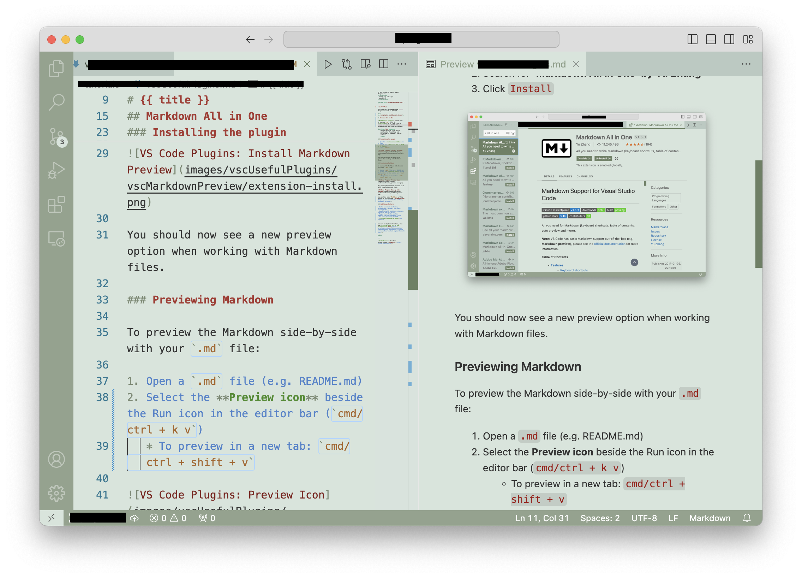


<frontmatter>
  title: "{{ title }}"
  pageNav: 2
</frontmatter>

<include src="vscode.md#wip-warning" />

# {{ title }}

## Markdown All in One

****Markdown All in One**** **plugin can be used to preview `.md` files in real-time while editing them in VS Code.** This is useful for editing README files, documentation, and tutorial content.

**The plugin helps mainly by,**

1.  **stylising the Markdown text in-place** (e.g., bold text is shown as bold) so that you get some sense of the formatting you are using, as is shown on the left side of the screenshot above.
1. **showing a preview of how the page will be rendered** in HTML, as shown on the right side of the screenshot above.

### Installing the plugin

1. Open the **Extensions sidebar** in VS Code.
2. Search for **‘Markdown All in One’ by Yu Zhang**.
3. Click `Install`.

You should now see a new preview option when working with Markdown files.

### Previewing Markdown

To preview the Markdown side-by-side with your `.md` file:

1. Open a `.md` file (e.g. README.md)
2. To see the rendered Markdown in a split view beside your code, select the **Preview icon** in the editor bar (see screenshot in the previous section) 

### Additional Features

* Useful shortcuts including autocomplete, keyboard shortcuts, pasting links.
* Supports LaTeX equations, diagrams, footnotes and math blocks.
* Toggle code blocks, section numbers, table of contents, lists.
* Can print documents to HTML.
* GitHub Flavoured Markdown is supported.

For more information, view the **_Markdown All in One_ documentation [here](https://marketplace.visualstudio.com/items?itemName=yzhang.markdown-all-in-one&ssr=false#user-content-keyboard-shortcuts-1)**.

---

**Contributors**: Sulaksha Muthukrishnan ([@crmlatte](https://github.com/crmlatte))
