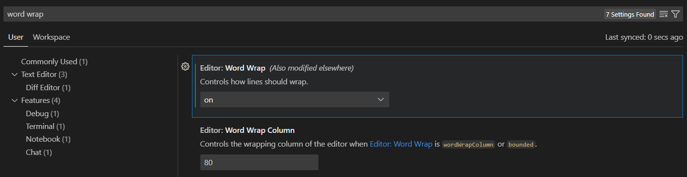
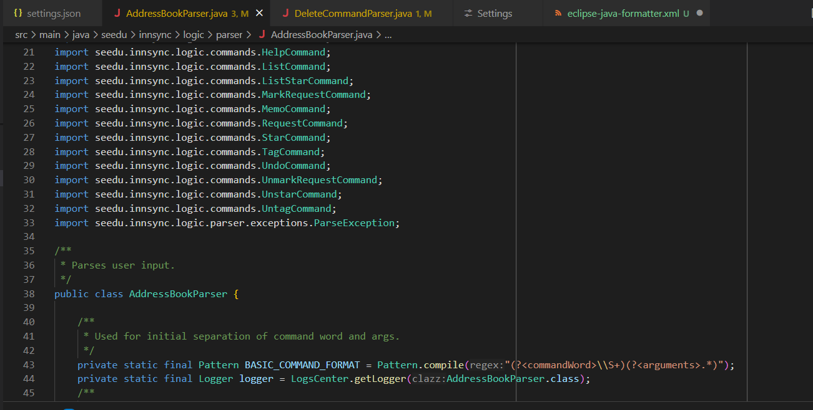
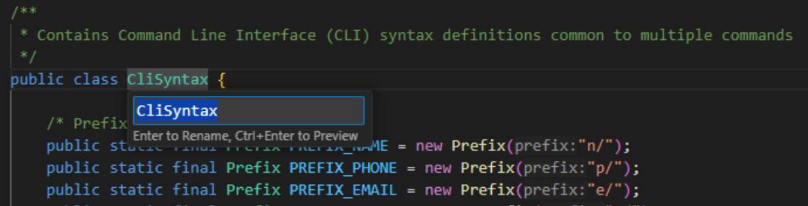
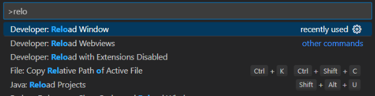
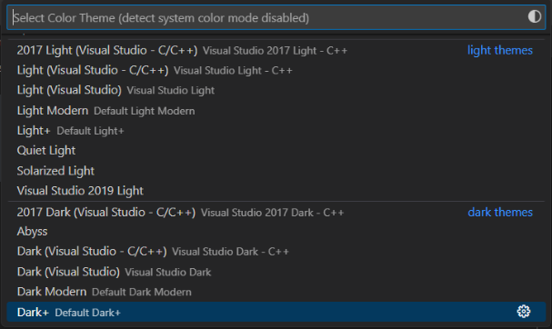


<frontmatter>
  title: "{{ title }}"
  pageNav: 2
</frontmatter>

<include src="vscode.md#wip-warning" />

# {{ title }}


## Modifying Visual Studio Code Settings

Visual Studio Code settings are accessible through the top menu navigation bar.    
* Windows: `File` → `Preferences` → `Settings`, or `Ctrl+,` (shortcut)    
* macOS: `Code` → `Preferences` → `Settings`, or `Cmd+,` (shortcut)    

Settings are stored in a `settings.json` file. Changes in `settings.json` will be reflected in the `Settings` tab UI and vice versa.    
* Workspace Settings: `.vscode/settings.json`    
* User Settings: `%APPDATA%\Code\User\settings.json` (Windows), `~/Library/Application Support/Code/User/settings.json` (macOS)    

<box type="tip" seamless>

**User Settings VS Workspace Settings**
Visual Studio Code allows you to configure User and Workspace Settings. User Settings apply to all projects & files and are suitable for your personal preferences and global defaults. Workspace settings apply only to the current project by overriding user settings and are suitable for project-specific rules that may differ from global.
</box>

Some settings are also configurable through the command palette (`Cmd+Shift+P` for macOS and `Ctrl+Shift+P` for Windows).


## Enabling word wrap

Enabling word wrapping improves readability by allowing long lines to automatically wrap based on the viewport width instead of extending horizontally beyond the viewport.

To enable word wrap:
1. Open Settings by going to `File` → `Preferences` → `Settings` (Windows), or `Code` → `Preferences` → `Settings` (macOS).
1. Search for `Editor: Word Wrap` and select `on` (see screenshot below).

    

You can also select other options based on your preference.

Word Wrap Options

| Value | Behaviour |
| --- | --- |
|"off" | No wrapping. Lines extend horizontally beyond the viewport. You'll need to scroll sideways. |
| "on" | Wrap at the viewport width. Long lines automatically wrap based on the visible editor area. |
| "wordWrapColumn" | Wraps at the number of characters defined by editor.wordWrapColumn (default is 80). |
|"bounded" | Wraps at the smaller of either the viewport width or the wordWrapColumn. Useful for maintaining a soft limit. |


## Show rulers

Rulers render vertical lines after a certain number of monospace characters. They are useful for keeping track of line length to easily stay within limit.

To enable rulers:
1. Add the following properties to your `settings.json`

Example: to enable rulers at 80 and 120
```
{
    //..
    "editor.rulers": [80, 120]
    //..
}
```




## Enabling assertions

<box type="warning" seamless>

This tweak does not apply if you use Gradle to run code even within VS Code. In that case, refer to 'Enabling assertions' sections of the [_Gradle tutorial_](gradle.html#enabling-assertions).
</box>

VS Code can be configured to enable assertions automatically when running or debugging through VS Code’s UI or play button.

<box type="warning" seamless>

This tweak does not apply if you directly run the application by typing `java ApplicationName.java` in the terminal.
</box>

To enable assertions:
1. Add the following properties to your `settings.json`
```
{
    // ...
    "java.debug.settings.vmArgs": "-ea"
    // ...
}
```
## Rename symbol

Rename Symbol is a built-in feature by VS Code which works with extensions to let users safely change the name of a variable, method, class, or any other symbol across your entire project. When you rename a symbol, all references to it are updated automatically, reducing the chance of errors.

To rename a symbol, use the `F2` shortcut or right click on the symbol and select `Reload Symbol`.



## Reload window

Sometimes, when installing or uninstalling extensions, editing formatting, or building a project, the editor appears unresponsive or buggy, usually also causing intellisense to not work as intended.

Developer: Reload Window is a command that does a soft restart of the editor window, without restarting the whole application. It
* Closes and reopens the current editor window
* Re-runs the extension host process
* Reloads:
    * All settings
    * Extensions
    * UI state
    * Workspaces and files (while keeping open files intact)
* Clears temporary memory/cache used by extensions and the editor

To run it:
1. Open Command Palette through `Ctrl+Shift+P` (Windows), or `Cmd+Shift+P` (macOS).
1. Search for `Developer: Reload Window` and hit `Enter` (see screenshot below).

    

## Editor color themes

Go to `File` → `Preferences` → `Themes` → `Color Theme`.


