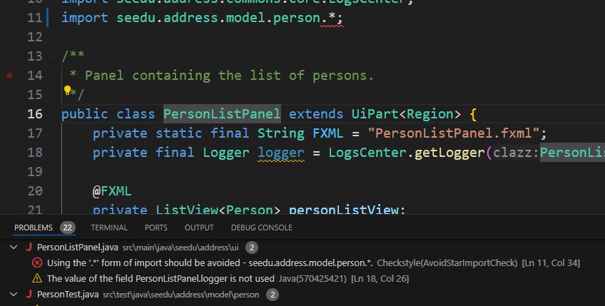


<frontmatter>
  title: "{{ title }}"
  pageNav: 0
</frontmatter>

# {{ title }}

<box type="warning">

This page contains **'community resources' contributed by students**.
</box>

## Setting up Checkstyle plugin for Java projects in VS Code

Given below are the steps to set up a Checkstyle plugin in VS Code such that VS Code can alert you about code style problems as you write code.

Prerequisite: The two Checkstyle files (`checkstyle.xml` and `suppressions.xml`) are present and stored in the `./config/checkstyle` directory [by convention](checkstyle.md).

1. Open Visual Studio Code.
2. If you haven't already downloaded the [Extension Pack for Java](https://marketplace.visualstudio.com/items?itemName=vscjava.vscode-java-pack) extension to import a Gradle project, download it using `Extensions -> Search 'Extension Pack for Java' -> Install`. This is required as the Checkstyle for Java extension is dependent on [Language Support for Java by Red Hat](https://marketplace.visualstudio.com/items?itemName=redhat.java), one of the extensions in this extension pack, to work properly.
3. Download the [Checkstyle for Java](https://marketplace.visualstudio.com/items?itemName=shengchen.vscode-checkstyle) extension by author **ShengChen** using `Extensions -> Search 'Checkstyle for Java' -> Install (the first entry)`.<br>
   
4. Open the project directory in Visual Studio Code using `File -> Open Folder...`.
5. Set up the extension to use the project's Checkstyle files as follows:
   1. Check if the `./.vscode/settings.json` file exists. If not, create a folder `.vscode` in the project root directory and add a file `settings.json` within the `.vscode` folder. This file contains configuration settings for projects in Visual Studio Code.
   2. Add these configuration settings to the `settings.json` file. These settings ensure that the Checkstyle extension uses the correct configuration files in the `./config/checkstyle` directory:

      ```
      {
        "java.checkstyle.configuration": "${workspaceFolder}/config/checkstyle/checkstyle.xml",
        "java.checkstyle.properties": {
          "config_loc": "${workspaceFolder}/config/checkstyle"
        }
      }    
      ```

6. Add `.vscode` to your `.gitignore` if you haven't done so by adding these few lines to the end of `.gitignore`:

    ```
    # VS Code
    /.vscode/
    ```

7. Now you should be able to edit your code with Checkstyle violations being detected as you edit them in the **Problems** tab in Visual Studio Code. For example, after changing the code to add a wildcard import, you can see that the **wildcard import** on line 11 has been detected by the Checkstyle extension:<br>
   
